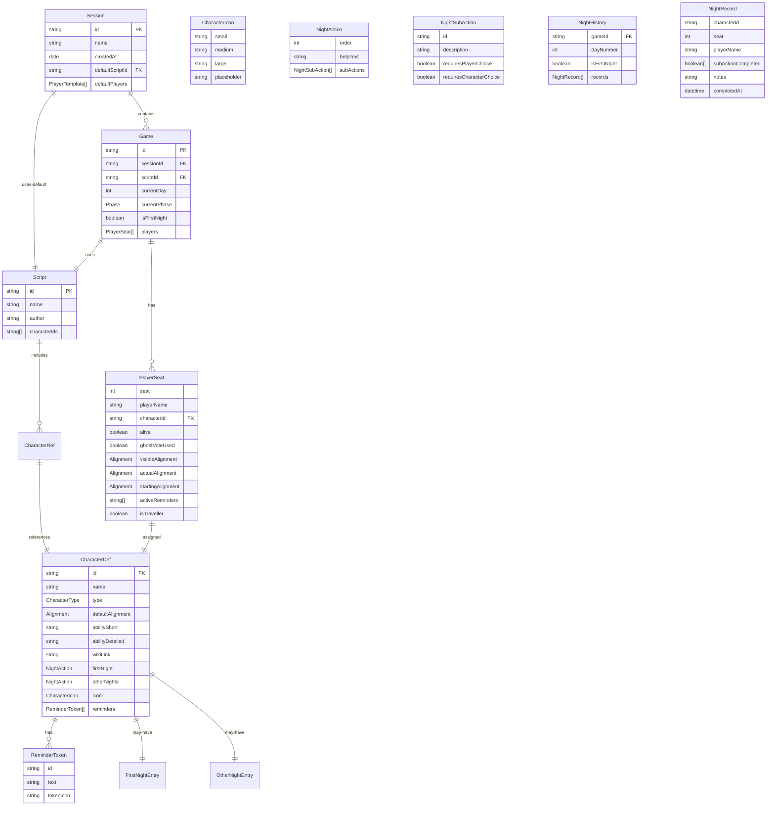
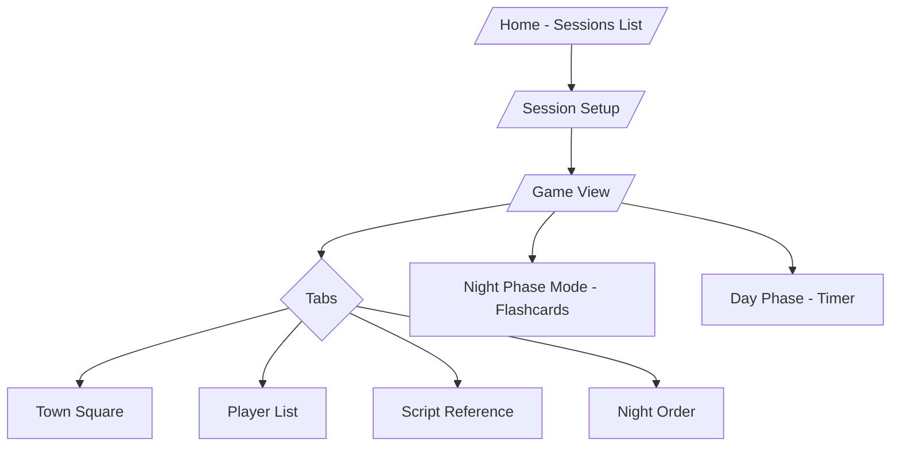
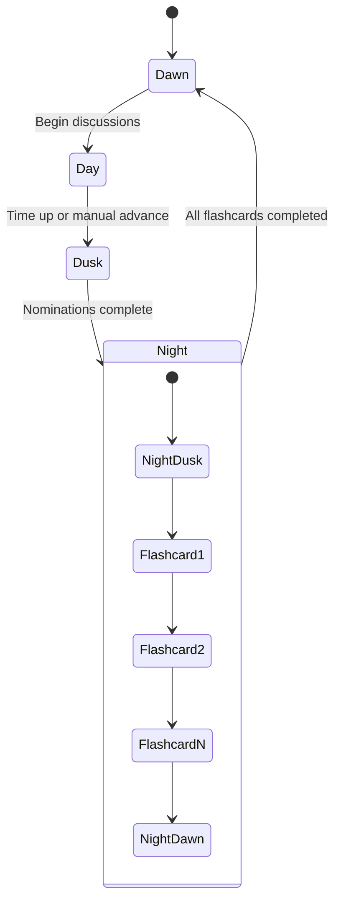
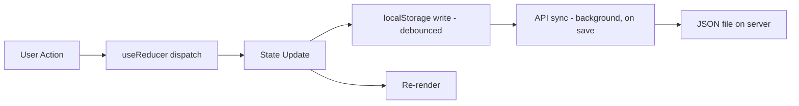

# Storyteller Cards — Architecture Plan

## Overview

A mobile-first React app to help Blood on the Clocktower Storytellers manage the behind-the-scenes complexity of running a game — especially the night phase. A lightweight Go API provides state persistence via local JSON files.

### Core Principles

- **All functional components** — modern React only, no class components
- **Game state is secret** — during the day phase, player tokens only show name + alive/dead + ghost vote status. Character details and alignments are hidden unless the Storyteller explicitly toggles "Show Characters"
- **Night history** — every night phase flashcard session is recorded and can be reviewed later to verify past actions
- **Swipe + checkmarks** — swipe to advance between character cards, checkmarks for individual sub-actions within a card (reset each night)

---

## Data Model

### Entity Hierarchy



### Key Design Decisions

1. **`CharacterDef`** is the master, read-only character definition. It lives in a bundled JSON database shipped with the app. Initially populated manually; later can be enriched from the wiki.

2. **`PlayerSeat`** is the mutable, per-game state of a player. It references a `CharacterDef` by ID and tracks alive/dead, alignment changes, and active reminder tokens.

3. **`Script`** is a thin wrapper — just metadata + a list of character IDs. Matches the official JSON format from `Boozling.json` where the first element is `{ id: "_meta", name, author }` and the rest are string IDs.

4. **Character IDs** use the all-lowercase, no-space convention from the official script JSON format (e.g., `nodashii`, `fanggu`, `highpriestess`, `scarletwoman`). A display name mapping exists in `CharacterDef.name`.

5. **Night Order** is derived by filtering the master night order list to only characters present in the active script, preserving the official ordering. Structural entries like Dusk, Minion Info, Demon Info, and Dawn are always included.

6. **Night History** — every time the night phase flashcard carousel is completed, the session (which sub-actions were checked, any notes) is appended to a `NightHistory` array on the game. This allows the Storyteller to go back and verify what happened on previous nights. Checkmarks reset for each new night session.

7. **Character Icons** — the `CharacterIcon` type has `small`, `medium`, `large` paths (for official art, added later) plus a `placeholder` field. Until real icons are provided, placeholders are colored circles based on character type (see Color Scheme below).

8. **Travellers** — can arrive and leave the game at any time via a dedicated "Add Traveller" / "Remove Traveller" action. On arrival, the Storyteller secretly assigns them an alignment (Good or Evil). They are NOT part of the script's character list — they are added directly to a game's player seats. The `isTraveller` flag on `PlayerSeat` tracks this.

### Color Scheme

| Character Type | Color | CSS Variable |
|---------------|-------|-------------|
| Townsfolk | Blue | `--color-townsfolk: #1976d2` |
| Outsider | Blue (lighter) | `--color-outsider: #42a5f5` |
| Minion | Red | `--color-minion: #d32f2f` |
| Demon | Dark Red | `--color-demon: #b71c1c` |
| Traveller | Half blue / half red (split) | `--color-traveller-good: #1976d2` / `--color-traveller-evil: #d32f2f` |
| Fabled | Orange → Gold gradient | `--color-fabled: linear-gradient(#ff9800, #ffd54f)` |
| Loric | Mossy Green | `--color-loric: #558b2f` |

These colors are used for: placeholder icons, token borders, type badges, and background tints on cards.

---

## Tech Stack

| Layer | Technology | Rationale |
|-------|-----------|-----------|
| UI Framework | React 19 + TypeScript | Latest standards, hooks-only state |
| Build Tool | Vite 6 | Fast dev, good React/TS support |
| Component Library | MUI Core (free) | Flexbox Grid, mobile-friendly, popular |
| State Management | React Context + useReducer + localStorage | No Redux per requirements |
| Component Testing | Storybook 8 | Isolated component development |
| Code Quality | ESLint 9 + Prettier | Flat config, modern standards |
| Git Hooks | Husky + lint-staged | Pre-commit: lint changed files; Pre-push: run tests |
| API | Go (standard library net/http + Chi router) | Simple, fast, fun to learn from C# background |
| API Storage | Local JSON files | No DB scope; 90-day auto-cleanup |
| Client Storage | localStorage / IndexedDB | Fast reads, API for cross-device sync |

### Why Chi over Gin/Echo/Fiber?

Chi is closest to Go's standard library `net/http`, uses the standard `http.Handler` interface, and is lightweight. It's the best choice for learning idiomatic Go while still having router conveniences.

---

## UI Architecture

### Page / Route Structure



### Screens

#### 1. Home / Sessions List
- List of existing sessions with date, name, game count
- Create new session button
- Import script from JSON file
- Delete/archive old sessions

#### 2. Session Setup
- Name the session
- Select or import a script
- Set up default player names + seat numbers (1–20)
- Create individual games within the session
- Players carry forward between games by default

#### 3. Game View — Main Gameplay Screen
The primary screen during play. Uses a **tab bar** at the bottom (mobile pattern) with 4 tabs:

**Tab: Town Square** (default)
- Phone: Ovoid/ellipse layout with player tokens
- Tablet: Full circle layout with more detail
- **Day View (default)**: Tokens show ONLY player name + alive/dead status + ghost vote indicator. NO character info visible. This is the safe view when players can see the screen.
- **Night View / "Show Characters" toggle**: Tokens expand to show character icon, character name, alignment color border. This is the Storyteller-only view.
- Tap a player token → quick actions: toggle alive/dead, use ghost vote, (in night view only) view character, swap character
- Visual indicators: alive (full color), dead/ghost (faded/greyed with ghost badge)
- "Add Traveller" button — opens dialog to pick a traveller character, assign seat + secret alignment. Traveller tokens show a split blue/red border.
- "Remove Traveller" — removes a traveller from the circle when they leave the game

**Tab: Player List**
- **Day View**: Scrollable table showing only Seat #, Player Name, Alive/Dead, Ghost Vote Used
- **Night View / "Show Characters"**: Full table with Seat #, Player Name, Character, Type, Alive/Dead, Alignment, Reminders
- Sortable by seat, name, or type
- Inline editing of character assignments and status (night view only)
- Travellers marked with a split-color indicator

**Tab: Script Reference**
- Characters grouped by type: Townsfolk → Outsiders → Minions → Demons
- Sorted within groups per `ScriptSortOrder.md` rules (ability text prefix grouping, then by text length)
- Each character shows: icon, name, short ability
- Expandable to show: detailed rules, wiki link, night action info, conflicts/jinxes

**Tab: Night Order**
- Shows the filtered night order for the current script
- Two sub-tabs or toggle: First Night / Other Nights
- Each entry: order position, icon, character name, help text
- Characters not in the current script are excluded
- Tap an entry to see the full flashcard instructions

#### 4. Night Phase Mode — Flashcard Carousel
Activated when entering the Night phase. This is the **core feature**.

- Full-screen swipeable flashcard carousel
- **Swipe left/right** to advance between character cards
- Each card shows:
  - Character icon (large, type-colored placeholder until real art is added)
  - Character name + type color border
  - Player name + seat number (who has this character)
  - Step-by-step storyteller instructions (from NightOrder data)
  - **Individual checkmarks** for each sub-action within the instructions (e.g., "wake the character" ☐, "they choose a player" ☐, "show token" ☐, "put to sleep" ☐)
  - Some characters have conditional sub-actions (e.g., "if they chose the Damsel...") — these show as nested/indented checkmarks
  - Optional notes field for Storyteller annotations
- **Sub-action checkmarks reset each new night** — they do NOT persist from previous nights
- Cards are ordered per the night order (First Night or Other Nights depending on game state)
- Dead players cards: still present but visually faded/greyed with a ghost badge. Sub-actions still checkable for rare token movements.
- Structural cards (Dusk, Minion Info, Demon Info, Dawn) included as separator/instruction cards
- Progress indicator showing current position (e.g., "5 / 14")
- "Complete Night" button at the end → saves the current flashcard session to Night History

#### 5. Night History
- Accessible from Game View via a button or drawer
- Shows a chronological list of completed night sessions: "Night 1 - First Night", "Night 2", "Night 3", etc.
- Tapping a past night shows the flashcard carousel in **read-only mode** with all the checkmarks and notes exactly as they were when that night was completed
- Useful for "did I poison the right player on Night 2?" type verification
- Each night session is appended; never overwrites previous nights

#### 6. Day Phase Timer
- Configurable countdown timer (default: e.g., 10 minutes)
- Audio alarm when time expires
- Pause/resume
- Visible from the Town Square tab as an overlay or header bar

### Phase Flow



---

## Component Hierarchy

All components are **functional components** using hooks. No class components.

```
App
├── AppRouter
│   ├── HomePage
│   │   ├── SessionCard (list item)
│   │   └── CreateSessionDialog
│   ├── SessionSetupPage
│   │   ├── ScriptImporter (JSON file upload)
│   │   ├── PlayerEditor (name + seat grid)
│   │   └── GameList (games in this session)
│   └── GameViewPage
│       ├── PhaseBar (Dawn/Day/Dusk/Night stepper + advance button)
│       ├── ShowCharactersToggle (day/night view switch)
│       ├── TabBar (bottom navigation)
│       ├── TownSquareTab
│       │   ├── TownSquareCircle / TownSquareOvoid
│       │   │   └── PlayerToken (day: name only / night: name + character + alignment)
│       │   ├── AddTravellerDialog
│       │   └── DayTimer (overlay)
│       ├── PlayerListTab
│       │   └── PlayerRow (day: limited / night: full detail, editable)
│       ├── ScriptReferenceTab
│       │   ├── CharacterTypeGroup
│       │   │   └── CharacterCard (expandable, type-colored)
│       │   └── CharacterDetailPanel
│       ├── NightOrderTab
│       │   ├── NightToggle (First / Other)
│       │   └── NightOrderEntry
│       ├── NightHistoryDrawer
│       │   └── NightHistoryEntry (read-only flashcard review)
│       └── NightPhaseMode (full-screen overlay)
│           ├── FlashcardCarousel (swipe-navigated)
│           │   ├── NightFlashcard (with SubActionChecklist)
│           │   └── StructuralCard (Dusk/Dawn/Info)
│           ├── NightProgressBar
│           └── CompleteNightButton
├── Providers
│   ├── GameStateProvider (Context + useReducer)
│   ├── SessionProvider
│   └── ThemeProvider (MUI, with type colors)
└── Layout
    └── BottomNav
```

---

## State Management

### Context Structure

```typescript
// SessionContext — manages sessions and their games
interface SessionState {
  sessions: Session[]
  activeSessionId: string | null
  activeGameId: string | null
}

// GameContext — manages the active game state
interface GameState {
  game: Game | null
  phase: Phase
  currentDay: number
  isFirstNight: boolean
  showCharacters: boolean  // day/night view toggle
  nightProgress: NightProgress
  nightHistory: NightHistoryEntry[]
}

interface NightProgress {
  currentCardIndex: number
  subActionStates: Record<string, boolean[]>  // characterId → checkmark states
  notes: Record<string, string>  // characterId → storyteller notes
  totalCards: number
}

interface NightHistoryEntry {
  dayNumber: number
  isFirstNight: boolean
  completedAt: string  // ISO timestamp
  subActionStates: Record<string, boolean[]>
  notes: Record<string, string>
}
```

### Persistence Strategy



- **Primary**: localStorage for instant reads/writes
- **Secondary**: API sync for cross-device backup (fire-and-forget on save)
- **Startup**: Load from localStorage first, then reconcile with API if available

---

## Go API Design

### Endpoints

| Method | Path | Description |
|--------|------|-------------|
| GET | /api/sessions | List all sessions |
| GET | /api/sessions/:id | Get session with games |
| POST | /api/sessions | Create session |
| PUT | /api/sessions/:id | Update session |
| DELETE | /api/sessions/:id | Delete session |
| GET | /api/sessions/:id/games/:gameId | Get game state |
| PUT | /api/sessions/:id/games/:gameId | Save game state |
| POST | /api/sessions/:id/games | Create new game in session |
| GET | /api/characters | List all character definitions |
| POST | /api/scripts/import | Import a script JSON |

### Storage Layout

```
data/
├── sessions/
│   ├── {session-id}.json
│   └── ...
├── characters/
│   └── master.json (bundled character database)
└── scripts/
    └── {script-id}.json
```

### 90-Day Cleanup

A goroutine runs on API startup that scans `data/sessions/` and deletes files with `createdAt` older than 90 days. Runs daily via a ticker.

---

## Character Data Strategy

### Phase 1 — Manual Seed (Current Scope)

Create a `characters/boozling-characters.json` with hand-curated data for the 25 Boozling characters:
- `id`, `name`, `type`, `defaultAlignment`
- `abilityShort` (from Boozling.pdf page 1)
- `firstNight` and `otherNights` order + helpText (from NightOrder.md, filtered to Boozling)
- No real icons yet — use placeholder colored circles by type (see Color Scheme: blue=Townsfolk, lighter blue=Outsider, red=Minion, dark red=Demon). Icon paths in data model are nullable, ready for real art later.

### Phase 2 — Expanded Database (Future)

- Manually add more characters from the wiki
- Or build a scraper/importer if a data source becomes available
- Icon assets from official sources or custom SVGs

### Night Order Parsing

The master night order from `NightOrder.md` will be parsed into a structured JSON:

```json
{
  "firstNight": [
    { "order": 0, "type": "structural", "id": "dusk", "helpText": "Start the Night Phase." },
    { "order": 1, "type": "character", "id": "philosopher", "helpText": "The Philosopher might choose..." },
    ...
  ],
  "otherNights": [...]
}
```

At runtime, the app filters this to only characters on the active script plus structural entries.

---

## Project Structure

```
StorytellerCards/
├── UI/
│   ├── public/
│   ├── src/
│   │   ├── components/
│   │   │   ├── common/          (Button overrides, Layout shells, etc.)
│   │   │   ├── TownSquare/      (TownSquareCircle, TownSquareOvoid, PlayerToken)
│   │   │   ├── NightPhase/      (FlashcardCarousel, NightFlashcard, StructuralCard)
│   │   │   ├── ScriptViewer/    (CharacterCard, CharacterTypeGroup, CharacterDetail)
│   │   │   ├── NightOrder/      (NightOrderEntry, NightToggle)
│   │   │   ├── PlayerList/      (PlayerRow, PlayerEditor)
│   │   │   ├── Session/         (SessionCard, CreateSessionDialog)
│   │   │   ├── Timer/           (DayTimer)
│   │   │   └── PhaseBar/        (PhaseBar, PhaseStep)
│   │   ├── pages/
│   │   │   ├── HomePage.tsx
│   │   │   ├── SessionSetupPage.tsx
│   │   │   └── GameViewPage.tsx
│   │   ├── context/
│   │   │   ├── SessionContext.tsx
│   │   │   └── GameContext.tsx
│   │   ├── hooks/
│   │   │   ├── useLocalStorage.ts
│   │   │   ├── useNightOrder.ts
│   │   │   ├── useTimer.ts
│   │   │   └── useApiSync.ts
│   │   ├── data/
│   │   │   ├── characters.json          (master character DB)
│   │   │   ├── nightOrder.json          (parsed from NightOrder.md)
│   │   │   └── scriptSortRules.ts       (consolidated sorting helper function from ScriptSortOrder.md)
│   │   ├── types/
│   │   │   └── index.ts                 (refined from Types.ts draft)
│   │   ├── utils/
│   │   │   ├── scriptImporter.ts        (parse Boozling.json format)
│   │   │   ├── nightOrderFilter.ts      (filter master order to active script)
│   │   │   └── storage.ts               (localStorage helpers)
│   │   ├── theme/
│   │   │   └── index.ts                 (MUI theme customization)
│   │   ├── App.tsx
│   │   └── main.tsx
│   ├── .storybook/
│   │   ├── main.ts
│   │   └── preview.ts
│   ├── .husky/
│   │   ├── pre-commit                   (lint-staged)
│   │   └── pre-push                     (run tests)
│   ├── .eslintrc.js
│   ├── .prettierrc
│   ├── tsconfig.json
│   ├── vite.config.ts
│   └── package.json
├── API/
│   ├── cmd/
│   │   └── server/
│   │       └── main.go                  (entry point)
│   ├── internal/
│   │   ├── handlers/                    (HTTP handlers)
│   │   ├── models/                      (Go structs)
│   │   ├── storage/                     (JSON file read/write)
│   │   └── cleanup/                     (90-day goroutine)
│   ├── data/                            (runtime JSON storage)
│   ├── go.mod
│   └── go.sum
├── Boozling.json                        (master copy — DO NOT MODIFY)
├── Boozling.pdf                         (reference — DO NOT MODIFY)
├── NightOrder.md                        (master copy — DO NOT MODIFY)
├── ScriptSortOrder.md                   (reference)
└── plans/
    └── architecture-plan.md             (this file)
```

---

## Implementation Phases

### Phase 0 — Project Scaffolding
- Initialize React + Vite + TypeScript project in UI/
- Configure MUI Core theme with character type color palette
- Set up ESLint 9 flat config + Prettier
- Set up Husky + lint-staged (pre-commit: lint, pre-push: test)
- Initialize Storybook 8 (infrastructure only — no stories yet, saves tokens for features first)
- Create a static test game state JSON file for UI development (no API needed yet)
- All components must be functional components (no class components)

### Phase 1 — Data Layer
- Define TypeScript types (refine from Types.ts draft, include NightHistory, CharacterIcon, NightSubAction)
- Create master character JSON for Boozling characters (manual from PDF)
- Parse NightOrder.md into structured nightOrder.json with sub-actions broken out
- Build script importer utility (parse official JSON format)
- Build night order filter utility (script → filtered night order)
- Consolidate ScriptSortOrder.md into a `scriptSortRules.ts` helper function
- Implement localStorage hooks (useLocalStorage)

### Phase 2 — Session & Game Management
- Build Session Context + reducer
- Build Game Context + reducer (including showCharacters toggle and nightHistory state)
- HomePage: session list, create session
- SessionSetupPage: player editor, script import, game creation
- Players carry forward between games in a session

### Phase 3 — Game View Core
- GameViewPage shell with bottom tab navigation
- PhaseBar (Dawn/Day/Dusk/Night stepper)
- ShowCharactersToggle (day view vs night/storyteller view)
- Player List tab (day view: limited info / night view: full detail with inline editing)
- Town Square tab — list/simple view first, with day/night visibility modes
- Script Reference tab (grouped, sorted, expandable, type-colored)
- Night Order tab (filtered, first/other toggle)

### Phase 4 — Night Phase Flashcards (Core Feature)
- NightFlashcard component (icon, character, player, sub-action checklist, notes field)
- SubActionChecklist component (individual checkmarks per instruction step, conditional/nested sub-actions)
- StructuralCard component (Dusk, Dawn, Minion/Demon Info)
- FlashcardCarousel (swipe to advance between cards)
- Night progress tracking (sub-action states per character)
- Dead player card styling (faded/greyed, still interactive)
- "Complete Night" flow → save to NightHistory

### Phase 4b — Storybook Sprint #1
Write Storybook stories for components built in Phases 1–4:
- NightFlashcard (alive player, dead/ghost player, various sub-action counts)
- SubActionChecklist (empty, partial, all checked)
- StructuralCard (Dusk, Dawn, Minion Info, Demon Info)
- FlashcardCarousel (mock multi-card swipe)
- CharacterCard (each type: Townsfolk, Outsider, Minion, Demon, Traveller)
- PhaseBar (each phase state)
- PlayerRow (day view vs night view)
- Any shared/common components

### Phase 5 — Night History
- NightHistoryDrawer accessible from Game View
- Chronological list of completed night sessions
- Read-only flashcard carousel mode showing past checkmarks + notes
- Data persists in game state (localStorage)

### Phase 6 — Town Square Visual
- TownSquareOvoid layout (phone)
- TownSquareCircle layout (tablet)
- PlayerToken component (day: name + alive/dead only / night: full detail with type-colored border)
- Tap interactions (toggle status, ghost vote, view character in night mode)
- Add/Remove Traveller flow (dialog to pick character, assign seat + secret alignment)

### Phase 6b — Storybook Sprint #2
Write Storybook stories for components built in Phases 5–6:
- TownSquareOvoid (phone layout, various player counts)
- TownSquareCircle (tablet layout)
- PlayerToken (day mode: name only / night mode: full detail / dead-ghost / traveller split-color)
- NightHistoryEntry (read-only flashcard review)
- DayTimer (running, paused, expired)
- AddTravellerDialog
- ShowCharactersToggle

### Phase 7 — Day Timer
- Configurable countdown
- Audio alarm
- Pause/resume
- Overlay on Town Square tab

### Phase 8 — Go API
- Initialize Go module in API/
- Set up Chi router with health endpoint
- Session CRUD endpoints
- Game state save/load endpoints
- JSON file storage layer
- 90-day cleanup goroutine
- CORS setup for local dev
- API sync hook in UI (useApiSync)

### Phase 9 — Polish & Testing
- Final Storybook review — fill gaps in coverage for any remaining components
- Responsive testing (phone portrait, tablet landscape)
- PWA manifest (installable)
- Error boundaries
- Loading states
- Accessibility pass (aria labels, keyboard nav)

---

## Open Questions / Deferred

1. **Character icons**: Using type-colored placeholder circles for now. Real icons to be added later — data model supports icon paths.
2. **Nomination tracking** (Dusk phase): Very low priority per requirements. Deferred.
3. **Cypress integration tests**: Potentially too expensive. Deferred unless time permits.
4. **Script sort order**: The `ScriptSortOrder.md` rules are complex (ability text prefix matching + length sorting). Will consolidate into a helper function; exact parity with official tool is not critical for MVP.
5. **Jinxes/Conflicts**: The Boozling PDF shows Djinn conflicts. These should be modeled as part of CharacterDef or Script. Will handle in Phase 1 data layer but display deferred to Phase 3.
6. **Travellers**: Fully supported in the data model and type system. Can arrive/leave at any time. Assigned a secret alignment on arrival. Split blue/red visual treatment.
7. **Fabled/Loric**: Included in the type system (Fabled = orange→gold, Loric = mossy green). UI support is lower priority but the data model is ready.
