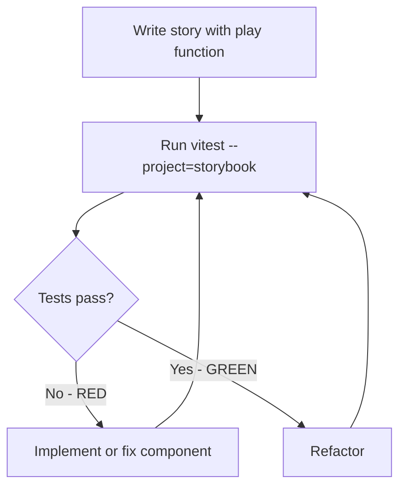

# Milestone 12 — Storybook Test Expansion

> **Goal:** Fix all 64 pre-existing a11y contrast violations failing in the Storybook test runner, then expand test-driven development by adding `play()` interaction tests to existing stories and creating new stories for uncovered components.

---

## Table of Contents

1. [Background](#1-background)
2. [Part 1 — Fix A11y Contrast Violations](#2-part-1--fix-a11y-contrast-violations)
3. [Part 2 — Expand Story Coverage](#3-part-2--expand-story-coverage)
4. [Part 3 — TDD Workflow with Storybook](#4-part-3--tdd-workflow-with-storybook)
5. [Pre-existing Issues](#5-pre-existing-issues)
6. [Execution Status Tracking](#6-execution-status-tracking)
7. [Success Criteria](#7-success-criteria)
8. [Testing Commands Reference](#8-testing-commands-reference)

---

## 1. Background

The Storybook test runner was fixed in Milestone 10. It now runs via:

```bash
cd UI && npx vitest run --project=storybook
```

This discovers **17 story files** with **113 tests**. However:

- **49 tests pass**, **64 tests fail**
- All 64 failures are **accessibility color contrast violations** from `@storybook/addon-a11y`
- [`preview.tsx`](../../../UI/.storybook/preview.tsx) sets `a11y: { test: 'error' }`, meaning all a11y violations are treated as test errors

The Storybook test runner complements the existing jsdom-based Vitest unit tests (1187 tests across 54 files) by running components in a **real Chromium browser** via Playwright. This milestone leverages that capability to expand test coverage.

---

## 2. Part 1 — Fix A11y Contrast Violations

### Problem

64 of 113 Storybook tests fail due to WCAG color contrast ratio violations. These are real accessibility issues in the component styles — text that is too low-contrast against its background for users with visual impairments.

### Approach

Fix the actual component styles and theme — **not** by disabling a11y testing. The `a11y: { test: 'error' }` setting is correct and should remain.

### Likely Affected Areas

| Area | Suspected Issue | Key Files |
|------|----------------|-----------|
| Dead player styling | Faded/ghost opacity on text creates low contrast | [`PlayerToken.tsx`](../../../UI/src/components/TownSquare/PlayerToken.tsx), [`PlayerRow.tsx`](../../../UI/src/components/PlayerList/PlayerRow.tsx) |
| Token badges/chips | Text on colored character-type backgrounds | [`TokenChips.tsx`](../../../UI/src/components/common/TokenChips.tsx), [`characterTypeColor.ts`](../../../UI/src/components/common/characterTypeColor.ts) |
| Night flashcard headers | Character type text on various colored backgrounds | [`NightFlashcard.tsx`](../../../UI/src/components/NightPhase/NightFlashcard.tsx), [`StructuralCard.tsx`](../../../UI/src/components/NightPhase/StructuralCard.tsx) |
| Phase bar indicators | Day/Night text or icons on phase-colored backgrounds | [`PhaseBar.tsx`](../../../UI/src/components/PhaseBar/PhaseBar.tsx) |
| MUI default greys | MUI's default disabled/secondary text colors | [`theme/index.ts`](../../../UI/src/theme/index.ts) |

### Tasks

#### P1-1: Identify Exact Violations

1. Run `cd UI && npx vitest run --project=storybook` and capture full output
2. Catalog each failing story and the specific a11y rule violated
3. Group violations by root cause — shared color constants, theme defaults, component-specific styles

#### P1-2: Fix Character Type Colors

1. Review color scheme constants in [`characterTypeColor.ts`](../../../UI/src/components/common/characterTypeColor.ts)
2. Ensure all text-on-background combinations meet WCAG AA contrast ratio of 4.5:1
3. Adjust colors while preserving the visual identity defined in the project color scheme:
   - Townsfolk Blue `#1976d2`
   - Outsider Light Blue `#42a5f5`
   - Minion Red `#d32f2f`
   - Demon Dark Red `#b71c1c`
   - Fabled Orange-gold `#ff9800` → `#ffd54f`
   - Loric Mossy green `#558b2f`
4. Where background colors cannot change, switch text to white or adjust text color for sufficient contrast

#### P1-3: Fix Theme-Level Contrast Issues

1. Review the MUI theme in [`theme/index.ts`](../../../UI/src/theme/index.ts)
2. Adjust default text colors, disabled states, and secondary text to meet WCAG AA
3. Ensure dark mode / dark backgrounds have appropriate light text

#### P1-4: Fix Component-Specific Contrast Issues

1. Fix dead player styling — use `opacity` on containers rather than text color reduction, or ensure faded text still meets minimum contrast
2. Fix any chip/badge text colors that fail against their backgrounds
3. Fix structural card text contrast

#### P1-5: Verify All Fixes

1. Run `cd UI && npx vitest run --project=storybook` — all 113 tests should pass
2. Run `cd UI && npm test` — all existing unit tests still pass
3. Run `cd UI && npx tsc --noEmit` — no TypeScript errors
4. Visually verify in Storybook that the color changes look acceptable

---

## 3. Part 2 — Expand Story Coverage

### Current Story Inventory

**17 files with stories:**

| Story File | Component | Has play Tests | Priority for play |
|-----------|-----------|:-:|---|
| [`CharacterCard.stories.tsx`](../../../UI/src/components/ScriptViewer/CharacterCard.stories.tsx) | CharacterCard | ❌ | Low — display only |
| [`DayTimer.stories.tsx`](../../../UI/src/components/Timer/DayTimer.stories.tsx) | DayTimer | ✅ | — |
| [`AddTravellerDialog.stories.tsx`](../../../UI/src/components/TownSquare/AddTravellerDialog.stories.tsx) | AddTravellerDialog | ✅ | — |
| [`PlayerQuickActions.stories.tsx`](../../../UI/src/components/TownSquare/PlayerQuickActions.stories.tsx) | PlayerQuickActions | ✅ | — |
| [`PlayerToken.stories.tsx`](../../../UI/src/components/TownSquare/PlayerToken.stories.tsx) | PlayerToken | ❌ | High — click actions, status changes |
| [`TownSquareLayout.stories.tsx`](../../../UI/src/components/TownSquare/TownSquareLayout.stories.tsx) | TownSquareLayout | ❌ | Low — layout only |
| [`PlayerRow.stories.tsx`](../../../UI/src/components/PlayerList/PlayerRow.stories.tsx) | PlayerRow | ❌ | High — edit actions, status toggles |
| [`PhaseBar.stories.tsx`](../../../UI/src/components/PhaseBar/PhaseBar.stories.tsx) | PhaseBar | ✅ | — |
| [`NightFlashcard.stories.tsx`](../../../UI/src/components/NightPhase/NightFlashcard.stories.tsx) | NightFlashcard | ❌ | High — sub-action checkmarks |
| [`NightProgressBar.stories.tsx`](../../../UI/src/components/NightPhase/NightProgressBar.stories.tsx) | NightProgressBar | ❌ | Low — display only |
| [`StructuralCard.stories.tsx`](../../../UI/src/components/NightPhase/StructuralCard.stories.tsx) | StructuralCard | ❌ | Low — display only |
| [`SubActionChecklist.stories.tsx`](../../../UI/src/components/NightPhase/SubActionChecklist.stories.tsx) | SubActionChecklist | ✅ | — |
| [`NightHistoryDrawer.stories.tsx`](../../../UI/src/components/NightHistory/NightHistoryDrawer.stories.tsx) | NightHistoryDrawer | ❌ | Medium — drawer open/close |
| [`CharacterDetailModal.stories.tsx`](../../../UI/src/components/common/CharacterDetailModal.stories.tsx) | CharacterDetailModal | ❌ | High — open/close, tab switching |
| [`ErrorBoundary.stories.tsx`](../../../UI/src/components/common/ErrorBoundary.stories.tsx) | ErrorBoundary | ❌ | Low — error display |
| [`LoadingState.stories.tsx`](../../../UI/src/components/common/LoadingState.stories.tsx) | LoadingState | ❌ | Low — display only |
| [`ShowCharactersToggle.stories.tsx`](../../../UI/src/components/common/ShowCharactersToggle.stories.tsx) | ShowCharactersToggle | ✅ | — |

**Summary:** 6 of 17 story files have `play()` tests. 11 story files render but do not test interactions.

### Components WITHOUT Stories (18 total)

**15 components + 3 pages:**

| Component | File | Complexity |
|-----------|------|-----------|
| CharacterAssignmentDialog | [`CharacterAssignmentDialog.tsx`](../../../UI/src/components/CharacterAssignment/CharacterAssignmentDialog.tsx) | High |
| NightHistoryReview | [`NightHistoryReview.tsx`](../../../UI/src/components/NightHistory/NightHistoryReview.tsx) | Low |
| NightOrderEntry | [`NightOrderEntry.tsx`](../../../UI/src/components/NightOrder/NightOrderEntry.tsx) | Low |
| NightOrderTab | [`NightOrderTab.tsx`](../../../UI/src/components/NightOrder/NightOrderTab.tsx) | Medium |
| FlashcardCarousel | [`FlashcardCarousel.tsx`](../../../UI/src/components/NightPhase/FlashcardCarousel.tsx) | High |
| NightChoiceSelector | [`NightChoiceSelector.tsx`](../../../UI/src/components/NightPhase/NightChoiceSelector.tsx) | Medium |
| NightPhaseOverlay | [`NightPhaseOverlay.tsx`](../../../UI/src/components/NightPhase/NightPhaseOverlay.tsx) | High |
| PlayerEditDialog | [`PlayerEditDialog.tsx`](../../../UI/src/components/PlayerList/PlayerEditDialog.tsx) | High |
| PlayerListTab | [`PlayerListTab.tsx`](../../../UI/src/components/PlayerList/PlayerListTab.tsx) | Medium |
| ScriptBuilder | [`ScriptBuilder.tsx`](../../../UI/src/components/ScriptBuilder/ScriptBuilder.tsx) | High |
| ScriptReferenceTab | [`ScriptReferenceTab.tsx`](../../../UI/src/components/ScriptViewer/ScriptReferenceTab.tsx) | Medium |
| DayTimerFab | [`DayTimerFab.tsx`](../../../UI/src/components/Timer/DayTimerFab.tsx) | Low |
| TokenManager | [`TokenManager.tsx`](../../../UI/src/components/TownSquare/TokenManager.tsx) | Low |
| TownSquareTab | [`TownSquareTab.tsx`](../../../UI/src/components/TownSquare/TownSquareTab.tsx) | Medium |
| TokenChips | [`TokenChips.tsx`](../../../UI/src/components/common/TokenChips.tsx) | Low |
| HomePage | [`App.tsx`](../../../UI/src/App.tsx) | Medium |
| SessionSetupPage | Page component | Medium |
| GameViewPage | Page component | High |

### Task P2-1: Add play Tests to Existing Stories

Add `play()` interaction tests to the 11 story files that currently only render. Priority order:

#### High Priority — Complex Interactions

| Story File | Interactions to Test |
|-----------|---------------------|
| [`PlayerToken.stories.tsx`](../../../UI/src/components/TownSquare/PlayerToken.stories.tsx) | Click token to open actions, verify status indicators for alive/dead |
| [`PlayerRow.stories.tsx`](../../../UI/src/components/PlayerList/PlayerRow.stories.tsx) | Click edit button, verify player info display, status toggle |
| [`NightFlashcard.stories.tsx`](../../../UI/src/components/NightPhase/NightFlashcard.stories.tsx) | Check/uncheck sub-action items, verify completion state |
| [`CharacterDetailModal.stories.tsx`](../../../UI/src/components/common/CharacterDetailModal.stories.tsx) | Open modal, verify character info, close modal |

#### Medium Priority — Moderate Interactions

| Story File | Interactions to Test |
|-----------|---------------------|
| [`NightHistoryDrawer.stories.tsx`](../../../UI/src/components/NightHistory/NightHistoryDrawer.stories.tsx) | Open/close drawer, verify history entries |

#### Low Priority — Display Components

| Story File | Interactions to Test |
|-----------|---------------------|
| [`CharacterCard.stories.tsx`](../../../UI/src/components/ScriptViewer/CharacterCard.stories.tsx) | Verify rendered content, character type styling |
| [`TownSquareLayout.stories.tsx`](../../../UI/src/components/TownSquare/TownSquareLayout.stories.tsx) | Verify token positions, player count display |
| [`NightProgressBar.stories.tsx`](../../../UI/src/components/NightPhase/NightProgressBar.stories.tsx) | Verify progress display, step indicators |
| [`StructuralCard.stories.tsx`](../../../UI/src/components/NightPhase/StructuralCard.stories.tsx) | Verify card type rendering — DUSK, DAWN, INFO |
| [`ErrorBoundary.stories.tsx`](../../../UI/src/components/common/ErrorBoundary.stories.tsx) | Verify error message display, fallback UI |
| [`LoadingState.stories.tsx`](../../../UI/src/components/common/LoadingState.stories.tsx) | Verify spinner and loading text |

### Task P2-2: Create New Stories — High Priority

Complex interactive components that benefit most from browser-based testing:

| Component | Story File to Create | Key Stories |
|-----------|---------------------|-------------|
| ScriptBuilder | `ScriptBuilder.stories.tsx` | Empty state, browsing characters, selecting characters, save/cancel flow |
| FlashcardCarousel | `FlashcardCarousel.stories.tsx` | Swipe navigation, card transitions, position tracking |
| NightPhaseOverlay | `NightPhaseOverlay.stories.tsx` | Overlay display, night phase progression, dismiss |
| PlayerEditDialog | `PlayerEditDialog.stories.tsx` | Form fields, validation, save/cancel, edit existing player |
| CharacterAssignmentDialog | `CharacterAssignmentDialog.stories.tsx` | Character selection, assignment confirmation, player list |

### Task P2-3: Create New Stories — Medium Priority

Components with moderate interactions:

| Component | Story File to Create | Key Stories |
|-----------|---------------------|-------------|
| PlayerListTab | `PlayerListTab.stories.tsx` | Player list rendering, add player, empty state |
| NightOrderTab | `NightOrderTab.stories.tsx` | Night order list, first night vs other nights tab |
| TownSquareTab | `TownSquareTab.stories.tsx` | Town square view, player tokens layout |
| ScriptReferenceTab | `ScriptReferenceTab.stories.tsx` | Script character list, character type grouping |
| NightChoiceSelector | `NightChoiceSelector.stories.tsx` | Choice rendering, selection handling for different choice types |

### Task P2-4: Create New Stories — Low Priority

Simple display components:

| Component | Story File to Create | Key Stories |
|-----------|---------------------|-------------|
| DayTimerFab | `DayTimerFab.stories.tsx` | FAB display, click to expand |
| TokenManager | `TokenManager.stories.tsx` | Token state display |
| TokenChips | `TokenChips.stories.tsx` | Chip rendering, reminder tokens |
| NightHistoryReview | `NightHistoryReview.stories.tsx` | Completed night data display |
| NightOrderEntry | `NightOrderEntry.stories.tsx` | Single entry rendering, status indicators |

---

## 4. Part 3 — TDD Workflow with Storybook

### How the Storybook Test Runner Enables TDD

The Storybook test runner transforms stories into real Vitest tests that execute in Chromium via Playwright. This enables a red-green-refactor TDD workflow for UI components.

### Workflow



#### Step-by-step:

1. **Write the story with `play()` test first** — define the expected behavior
   ```typescript
   export const TogglesDead: Story = {
     play: async ({ canvasElement }) => {
       const canvas = within(canvasElement);
       const token = canvas.getByRole('button');
       await userEvent.click(token);
       const killButton = canvas.getByText('Kill');
       await userEvent.click(killButton);
       await expect(canvas.getByText('Dead')).toBeInTheDocument();
     },
   };
   ```

2. **Run in watch mode:** `cd UI && npx vitest --project=storybook`
   - Tests run automatically on save
   - Failed tests show in terminal output

3. **Implement or fix the component** until the test passes

4. **Refactor** with confidence — the test catches regressions

5. **Storybook UI** also shows pass/fail status in the sidebar when running `npx storybook dev`

### Coverage Complement Strategy

The Storybook tests run in a **real browser**, complementing jsdom-based unit tests. Components with low unit test coverage benefit most from story-based testing:

| Component | Unit Test Coverage - Lines | Benefit from Stories |
|-----------|:-:|---|
| SessionSetupPage.tsx | 43.1% | High — complex page with multiple interactions |
| NightFlashcard.tsx | 59.5% | High — gesture-based interactions hard to test in jsdom |
| TownSquareTab.tsx | 60.2% | High — layout-dependent rendering |
| PlayerListTab.tsx | 65.4% | Medium — list interactions |
| FlashcardCarousel.tsx | 67.1% | High — swipe/animation behavior requires real browser |

---

## 5. Pre-existing Issues

The following issues should be addressed as part of this milestone or explicitly tracked:

### 5.1 NightChoiceHelper.test.ts — Missing Source Module

[`NightChoiceHelper.test.ts`](../../../UI/src/components/NightPhase/NightChoiceHelper.test.ts) exists with 25 tests, but the source module `NightChoiceHelper.ts` no longer exists — it was removed or refactored during Milestone 6 character restructuring. All 25 tests fail on import.

**Action:** Determine whether `NightChoiceHelper.ts` should be restored, the tests should be updated to target the replacement module, or the test file should be removed.

### 5.2 ScriptBuilder.test.tsx — Skipped Test

One test in [`ScriptBuilder.test.tsx`](../../../UI/src/components/ScriptBuilder/ScriptBuilder.test.tsx) is skipped via `it.skip()` due to a performance timeout under coverage mode. This is tracked in [Milestone 11](../11%20-%20scriptbuilder-perf/milestone11.md).

**Action:** No action needed in this milestone — tracked separately in M11.

### 5.3 ESLint Error in ScriptBuilder.tsx

[`ScriptBuilder.tsx`](../../../UI/src/components/ScriptBuilder/ScriptBuilder.tsx) has 1 ESLint error for `set-state-in-effect` — setting state inside a `useEffect`.

**Action:** Fix the ESLint error as part of this milestone or M11.

---

## 6. Execution Status Tracking

| Task ID | Description | Status | Notes |
|---------|-------------|--------|-------|
| **P1-1** | Identify exact a11y violations | ⬚ Pending | Run storybook tests, catalog failures |
| **P1-2** | Fix character type colors | ⬚ Pending | Adjust `characterTypeColor.ts` |
| **P1-3** | Fix theme-level contrast | ⬚ Pending | Adjust `theme/index.ts` |
| **P1-4** | Fix component-specific contrast | ⬚ Pending | Dead players, chips, structural cards |
| **P1-5** | Verify all fixes | ⬚ Pending | 113/113 storybook tests pass |
| **P2-1** | Add `play()` tests to 11 existing stories | ⬚ Pending | High → Medium → Low priority |
| **P2-2** | Create new stories — High priority (5) | ⬚ Pending | ScriptBuilder, FlashcardCarousel, NightPhaseOverlay, PlayerEditDialog, CharacterAssignmentDialog |
| **P2-3** | Create new stories — Medium priority (5) | ⬚ Pending | PlayerListTab, NightOrderTab, TownSquareTab, ScriptReferenceTab, NightChoiceSelector |
| **P2-4** | Create new stories — Low priority (5) | ⬚ Pending | DayTimerFab, TokenManager, TokenChips, NightHistoryReview, NightOrderEntry |
| **P3** | Document TDD workflow | ⬚ Pending | Update `docs/testing.md` with Storybook TDD section |
| **I-1** | Resolve NightChoiceHelper.test.ts | ⬚ Pending | Missing source module |
| **I-2** | Fix ScriptBuilder.tsx ESLint error | ⬚ Pending | `set-state-in-effect` |

---

## 7. Success Criteria

### Part 1 Complete

- [ ] **0 Storybook test failures** — all 113+ tests pass via `npx vitest run --project=storybook`
- [ ] **No a11y testing disabled** — `a11y: { test: 'error' }` remains in preview.tsx
- [ ] **Visual appearance preserved** — color adjustments maintain the project's visual identity
- [ ] **All unit tests still pass** — `npm test` reports 0 failures
- [ ] **0 TypeScript errors** — `npx tsc --noEmit` clean
- [ ] **0 ESLint errors** — `npx eslint .` clean

### Part 2 Complete

- [ ] **All 17+ existing stories have `play()` interaction tests**
- [ ] **15 new story files created** for currently uncovered components
- [ ] **All new stories include `play()` interaction tests** for interactive components
- [ ] **All Storybook tests pass** via `npx vitest run --project=storybook`
- [ ] **Story count target:** 32+ story files, 200+ total Storybook tests

### Pre-existing Issues Resolved

- [ ] **NightChoiceHelper.test.ts** resolved — tests updated or removed
- [ ] **ScriptBuilder.tsx ESLint error** fixed

### Overall

- [ ] **All unit tests pass** — `cd UI && npm test`
- [ ] **All Storybook tests pass** — `cd UI && npx vitest run --project=storybook`
- [ ] **0 TypeScript errors** — `cd UI && npx tsc --noEmit`
- [ ] **0 ESLint errors** — `cd UI && npx eslint .`
- [ ] **Coverage thresholds maintained** — `cd UI && npm run test:coverage`

---

## 8. Testing Commands Reference

| Command | Purpose |
|---------|---------|
| `cd UI && npx vitest run --project=storybook` | Run all Storybook tests (CI mode) |
| `cd UI && npx vitest --project=storybook` | Run Storybook tests in watch mode (TDD) |
| `cd UI && npm test` | Run all unit tests |
| `cd UI && npm run test:watch` | Unit tests in watch mode |
| `cd UI && npm run test:coverage` | Unit tests with coverage thresholds |
| `cd UI && npx tsc --noEmit` | TypeScript compilation check |
| `cd UI && npx eslint .` | Lint check |
| `cd UI && npx storybook dev` | Run Storybook UI for visual testing |
