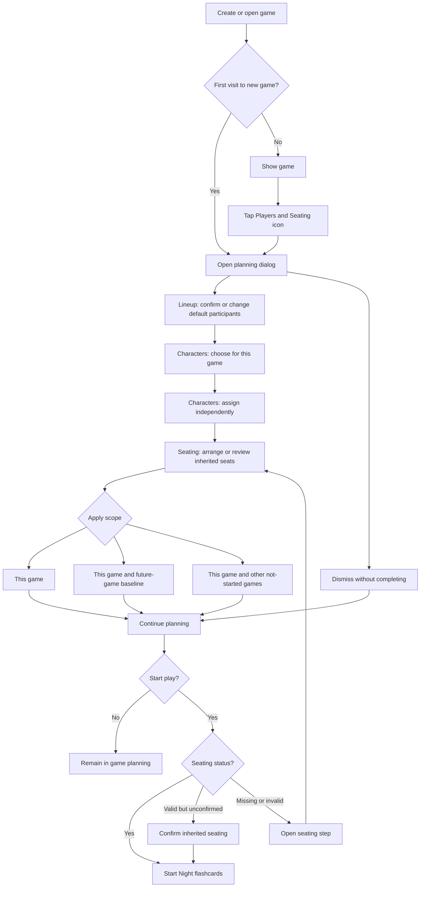
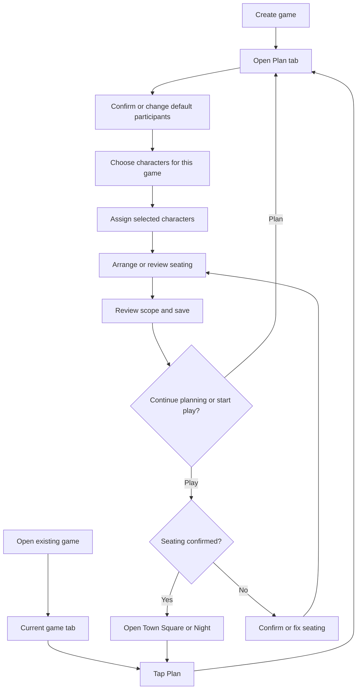
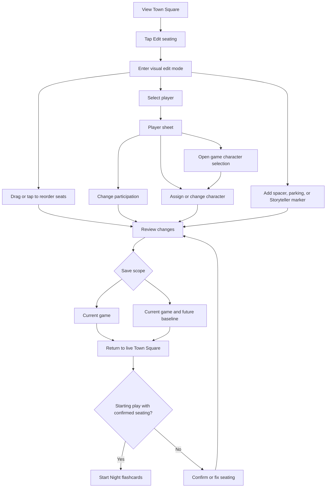
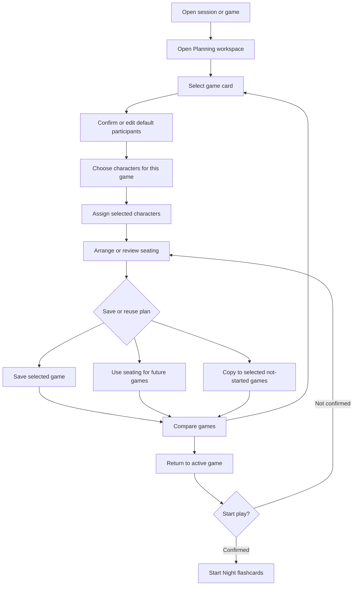
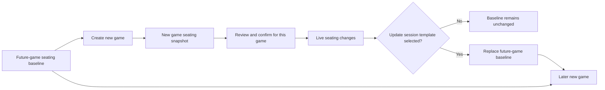
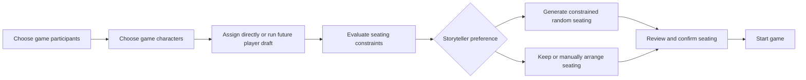

# Milestone 42: In-Game Planning Workflow

## Status: ✅ Complete

**Completion date:** 2026-08-23

This milestone evaluated four ways to remove the workflow break between
session-level seating setup and game-level player and character planning. All
four options were prototyped for comparison. Option 3, Town Square Edit Mode,
was selected and completed as the final M42 workflow.

## Problem

Milestones 40 and 41 separated the underlying concepts correctly:

- The **session roster** defines the people available throughout a session.
- **Game participants** define which people are playing in a specific game.
- **Character selection** defines which characters from the script are available
  in a specific game.
- **Character assignments** belong to a game and do not require assigned seats.
- **Seating** defines the required arrangement for a specific game before play
  starts.

The UI does not reflect that separation as one coherent planning flow. Roster
and seating management live on the session setup screen, while participant and
character planning live inside each game. A Storyteller who notices a seating
issue while planning or running a game must leave the game, edit the session,
and navigate back. That interruption is especially costly on a phone and can
make session-wide settings feel incorrectly coupled to the current game.

## Goals

1. Let the Storyteller manage players, characters, and seating without leaving
   the current game.
2. Keep game participation and character assignment independent from seating.
3. Support planning before a game and corrections while a game is running.
4. Make the scope of every change clear: current game, future games, or other
   games in the session.
5. Give a newly created game useful participant and seating defaults without
   forcing the Storyteller to complete or confirm seating during early planning.
6. Preserve a fast, mobile-first path for common edits.
7. Require valid, confirmed seating before the Storyteller starts play, such as
   entering the Night flashcards.

## Non-Goals

- Recombine player identity, character assignment, and seat assignment in the
  data model.
- Require seating to create a game, choose the game's characters, or assign
  characters to players.
- Automatically rewrite active or completed games without explicit approval.
- Replace the Town Square as the primary view during play.
- Make every game share one live seating arrangement.
- Implement player character drafting or constrained seating generation in this
  milestone.

## Shared Concepts and Scope Rules

All options should present the same domain concepts and change scopes.

| Concept | Ownership | Expected behavior |
| --- | --- | --- |
| Session roster | Session-wide | Adding, renaming, or retiring a player affects the session roster. |
| Default lineup | Session planning state | New games start with the same participant list by default. |
| Participants | Per game | A new game copies the default lineup, after which a player can be included in one game and omitted from another. |
| Character selection | Per game | The Storyteller chooses the characters available in this game from its script before assigning them. |
| Character assignments | Per game | Selected characters can be assigned to participants before seats are defined. |
| Current seating | Per game | Seat order, spacers, parking, and Storyteller position can change independently in each game, but must be confirmed before play starts. |
| Future-game seating baseline | Session planning state | A deliberate baseline used when creating the next game. |

The UI should avoid a generic **Apply to all games** action when a narrower,
safer scope can be named. Recommended seating actions are:

- **Apply to this game**: updates only the open game.
- **Use for future games**: saves the arrangement as the baseline for games
  created later.
- **Apply to other not-started games**: copies the arrangement to selected or
  all games that have not started.

Active and completed games should never be changed by a bulk action. If a
Storyteller needs to correct the active game, that edit should happen explicitly
from that game.

Creating and planning a game remains permissive. The Storyteller may choose
participants, select characters, and assign characters with incomplete or
unconfirmed seating. Starting play is the boundary that requires seating:

- If inherited seating is still valid, present a compact confirmation before
  starting.
- If seating is missing or invalid, open the seating step and explain what must
  be resolved.
- Confirming seating records game-specific confirmation; it does not make the
  arrangement globally authoritative.
- Before the game starts, changes to participants or seat assignments invalidate
  confirmation. Once play has started, explicit in-game seating corrections do
  not send the Storyteller back through the pre-game gate.

## Option 1: In-Game Players and Seating Dialog

Add a persistent planning icon to the game AppBar. It opens a full-screen dialog
on phones and a large modal on wider screens. The dialog contains four
sections:

1. **Lineup**: manage the session roster and select this game's participants.
   New games initially use the session's default participant list.
2. **Character selection**: choose the characters in this game from the
   selected script.
3. **Character assignments**: assign selected characters to participants
   without requiring seats.
4. **Seating**: arrange participants, spacers, parking, and the Storyteller
   marker.

The dialog uses draft state. Changes are reviewed and applied explicitly, so a
drag or tap does not unexpectedly propagate to other games.

When a new game is opened for the first time, the dialog opens automatically as
a non-blocking prompt. The Storyteller can dismiss it and continue planning with
incomplete or unconfirmed seating. When the Storyteller starts play, the app
requires a valid seating arrangement and asks for confirmation if the inherited
arrangement has not yet been confirmed for this game.

### Strengths

- Resolves the immediate navigation break with the smallest conceptual change.
- Works before and during play from every game screen.
- Keeps planning controls available without permanently consuming mobile space.
- Supports the user's proposed automatic first-open prompt.
- Can reuse existing session and game context operations.

### Risks

- A large dialog can become dense if all four sections are shown at once.
- Users may miss advanced planning features behind the AppBar icon.
- Drafting changes across session and game state requires careful save and
  cancellation behavior.

### Mitigations

- Use a four-step layout or tabs with visible completion summaries.
- Show incomplete-planning status beside the icon.
- Keep common actions one tap away and move propagation choices into the final
  Apply step.

## Option 2: Permanent Plan Tab Inside Each Game

Add **Plan** as a permanent game navigation destination alongside the Town
Square and other game views. It contains Lineup, Character selection, Character
assignments, and Seating sections and remains available throughout the game.

Unlike a modal, the Plan tab is a first-class screen with room for summaries,
validation, and richer controls. Creating a game navigates to Plan initially,
but the Storyteller can switch away immediately.

### Strengths

- Highly discoverable and easy to revisit.
- Provides enough space for complex planning and validation.
- Clearly establishes planning as part of a game rather than session
  administration.
- Avoids an oversized modal with nested scrolling.

### Risks

- Adds another permanent destination to already constrained mobile navigation.
- Switching tabs can still feel like leaving the live game, although less than
  returning to the session screen.
- Planning controls may duplicate information already shown elsewhere.

### Mitigations

- Use a compact navigation icon and show labels only when space permits.
- Preserve the current Town Square state while moving between tabs.
- Reuse shared planning components rather than implementing separate dialog and
  page variants.

## Option 3: Town Square Edit Mode

Add an **Edit seating** action directly to the Town Square. In edit mode, the
Storyteller can rearrange seats, add or remove spacers, park players, and open a
player drawer to change participation or character assignment. Character
selection remains a separate planning action because the visual circle is not
an effective character-pool editor.

This option treats the visual circle as the primary editing surface. It is
optimized for quick corrections during play, with broader roster management in
a secondary drawer or sheet.

### Strengths

- Best direct-manipulation experience for mid-game seating corrections.
- Keeps the Storyteller visually grounded in the circle.
- Makes the relationship between a player and a seat immediately clear.
- Requires few steps for common seat swaps.

### Risks

- A circular layout is less efficient for roster and character planning.
- Mobile drag-and-drop can conflict with scrolling and swipe gestures.
- Mixing live play and edit interactions increases the risk of accidental
  changes.
- Cross-game scope is less natural from a current-game visual surface.

### Mitigations

- Require an explicit edit mode with strong visual treatment.
- Provide tap-based movement as an alternative to dragging.
- Keep changes in a draft until Save is selected.
- Limit bulk scope choices to a final confirmation.

## Option 4: Cross-Game Planning Workspace

Add a session-level planning workspace that shows games as columns or cards.
The Storyteller can compare participants, characters, and seating across
multiple games and copy plans between them. The workspace is reachable from
both the session screen and every game.

This option targets Storytellers who plan several games in advance. It provides
the strongest cross-game visibility but is the largest departure from the
current mobile workflow.

### Strengths

- Best experience for planning a full session in advance.
- Makes differences between game lineups and seating arrangements visible.
- Supports explicit copying rather than implicit propagation.
- Provides a natural home for templates and future-game defaults.

### Risks

- Highest implementation and interaction-design complexity.
- A multi-game view is difficult to use effectively on a phone.
- Too heavy for a quick correction during an active game.
- Risks recreating the original session/game disconnect if it feels like a
  separate administrative tool.

### Mitigations

- Use a single-game mobile view with horizontal game switching.
- Preserve a direct return path to the active game.
- Pair it with a lightweight in-game quick editor.

## Comparison

Scores use 1 as weakest and 5 as strongest.

| Criterion | Option 1: Dialog | Option 2: Plan tab | Option 3: Edit mode | Option 4: Workspace |
| --- | ---: | ---: | ---: | ---: |
| Pre-game planning | 5 | 5 | 3 | 5 |
| Mid-game correction | 5 | 4 | 5 | 2 |
| Mobile usability | 5 | 4 | 4 | 2 |
| Discoverability | 4 | 5 | 5 | 3 |
| Character selection and assignment without seats | 5 | 5 | 3 | 5 |
| Start-game seating confirmation | 5 | 5 | 4 | 4 |
| Cross-game planning | 3 | 3 | 2 | 5 |
| Implementation simplicity | 4 | 3 | 3 | 1 |
| Accidental-change safety | 5 | 5 | 3 | 5 |

## Decision

**Option 3: Town Square Edit Mode** was selected after side-by-side evaluation
of all four prototypes. Keeping the Storyteller on the Town Square proved more
intuitive than introducing a comprehensive dialog, permanent planning tab, or
cross-game workspace.

The completed implementation supplements the visual editor with focused player
actions and separate Character Selection and Character Assignment entry points.
This preserves the required preparation stages without forcing roster and
character-pool management into the seating circle.

## Recommended New-Game Behavior

A new game starts with:

1. The current session default lineup copied as the game's participant list.
   The Storyteller can then change participation for this game without changing
   every other game.
2. No character selection or assignments copied unless an explicit game-copy
   workflow requests them.
3. Seating initialized from the session seating template.
4. Immediate access to Town Square Edit Seating through the AppBar chair icon,
   without forcing the editor open during early planning.
5. A required seating check when starting play. Valid inherited seating needs
   only a concise confirmation; missing or invalid seating must be fixed.

When saving seating, the Storyteller can select **Update session template**.
That deliberate action makes the edited arrangement the baseline inherited by
later games. A current-game-only save leaves the template unchanged, so live
corrections do not silently rewrite future planning.

## Future Compatibility: Player Character Drafting

Player Character Drafting is explicitly out of scope for M42, but the planning
workflow must leave room for it. In a future milestone, each player may choose
from a random selection of three available characters from the game's selected
character pool.

That flow can introduce character-dependent seating constraints. Some drafted
characters may need to sit next to, or avoid sitting next to, particular other
characters. Future seating generation therefore may be:

- Truly randomized when no constraints apply.
- Constraint-aware randomized when character abilities restrict adjacency.
- Suggested by the app and then adjusted by the Storyteller.
- Set entirely by the Storyteller.

M42 should not implement those rules, but it should avoid treating inherited
seat order as final before characters are known. The four-stage preparation
model supports this future flow:

Before a game starts, seating confirmation should be invalidated when character
assignments change in a way that could affect seating constraints. The initial
M42 implementation may conservatively invalidate confirmation after any
pre-game character assignment change, leaving more precise ability-aware
validation to the drafting milestone.

## State and Implementation Implications

The existing M41 data model should remain the foundation. The implementation is
expected to need orchestration and a small amount of new planning metadata, not
a replacement model.

Potential additions:

- A session-level future-game seating baseline, either by clarifying the
  semantics of `Session.template` or introducing an explicitly named planning
  field.
- Per-game metadata recording whether the initial planning prompt has been
  dismissed and whether seating has been confirmed.
- A session-level default lineup copied into new games.
- A draft model for atomic changes spanning session roster and current-game
  participants, character selection, character assignments, and seating.
- Guarded bulk operations that target only not-started games.
- A pre-game seating-confirmation invalidation policy for participant,
  character, and seat changes.
- A future extension point for constraint-aware seating generation without
  embedding drafting rules in M42.

Existing game slot operations can continue to power in-game edits. The planning
surface should coordinate those operations with participant and character
updates and present one explicit Apply step.

## Implementation Outcome

- Added Town Square Edit Seating behind an AppBar chair action.
- Added draft, review, save, and cancel behavior for safe visual editing.
- Added focused game-participant, Traveller, and character-assignment actions.
- Kept Character Selection and Character Assignment as separate preparation
  stages.
- Added explicit current-game, session-template, and eligible sibling-game
  scopes.
- Added a persisted default lineup and session seating template for new games.
- Added valid-seating enforcement and confirmation at the first Night boundary.
- Protected started games from bulk template propagation.
- Added full-stack lifecycle coverage for inheritance, propagation, overrides,
  refresh, and Travellers.

## Resolved Decisions

1. `Session.template` remains the deliberate future-game seating baseline.
2. Game creation and early preparation remain non-blocking; the editor does not
   auto-open.
3. Session roster changes save at session scope, while game edits remain drafted.
4. Bulk application updates seating and safely merges template players into
   eligible unstarted games without replacing game-specific participants.
5. Games with completed days or nights are protected from bulk changes.
6. The AppBar chair icon is the persistent in-game seating entry point.
7. Pre-game participant or seating changes invalidate seating confirmation.
   Character-aware constraint invalidation remains part of future drafting work.
8. The session default lineup is explicitly editable and copied into new games.

## Acceptance Criteria

- [x] The selected design is reachable from inside every game.
- [x] A Storyteller can assign participants and characters without assigning
      seats.
- [x] Character selection for the game is a distinct preparation stage before
      character assignment.
- [x] New games default to the same session participant lineup while allowing
      per-game changes.
- [x] A Storyteller can correct current-game seating without returning to the
      session screen.
- [x] New games receive a deliberate future-game seating baseline rather than
      an uncontrolled copy of live seating.
- [x] Game creation and early preparation are not blocked by incomplete seating.
- [x] Starting play, including entering Night flashcards, requires valid
      game-specific seating confirmation.
- [x] Valid inherited seating can be confirmed with minimal interruption.
- [x] Change scope is explicit before any cross-game update.
- [x] Active and completed games are protected from bulk propagation.
- [x] The primary workflow is practical on a phone.
- [x] The design leaves an extension point for future constraint-aware
      randomized seating after player character drafting.
