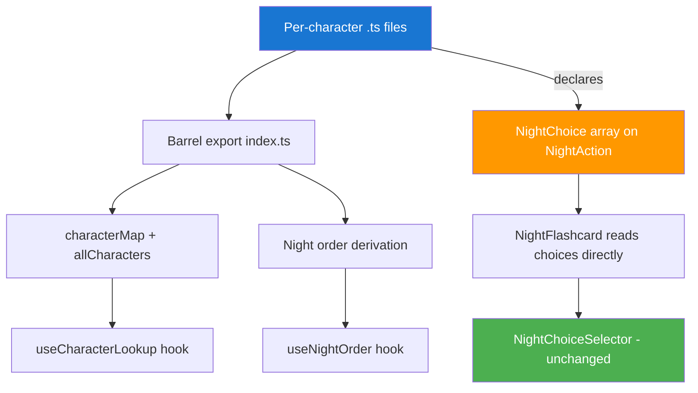
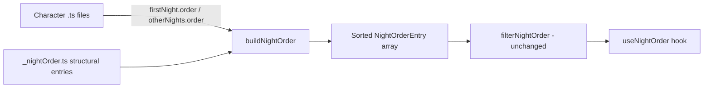

# Milestone 6 — Character Data Restructuring

> **Goal:** Eliminate data duplication between `characters.json` and `nightOrder.json`, replace brittle regex-based night choice parsing with a declarative schema, and move from monolithic JSON to individual TypeScript character files that are type-safe, navigable, and extensible.

---

## Table of Contents

1. [Problem Statement](#1-problem-statement)
2. [Solution Overview](#2-solution-overview)
3. [New Type Definitions](#3-new-type-definitions)
4. [File Structure](#4-file-structure)
5. [Character File Template](#5-character-file-template)
6. [Barrel Export & Character Registry](#6-barrel-export--character-registry)
7. [Night Order Derivation](#7-night-order-derivation)
8. [Migration Plan for Consumers](#8-migration-plan-for-consumers)
9. [Phased Execution Plan](#9-phased-execution-plan)
10. [Backward Compatibility Strategy](#10-backward-compatibility-strategy)
11. [Future Extensions](#11-future-extensions)
12. [Open Questions / Decisions Needed](#12-open-questions--decisions-needed)

---

## 1. Problem Statement

Three interrelated problems have emerged as the character roster grows:

### 1.1 Data Duplication

Character data lives in two separate JSON files maintained independently:

| File | Entries | Contains |
|------|---------|----------|
| [`characters.json`](../../UI/src/data/characters.json) | 43 characters | `id`, `name`, `type`, `abilityShort`, inline `firstNight`/`otherNights` with `helpText` + `subActions`, `reminders` |
| [`nightOrder.json`](../../UI/src/data/nightOrder.json) | 168 entries | `order`, `id`, `name`, `helpText`, `subActions` for **all** BotC characters + structural entries |

The same `helpText` and `subActions` appear in both files for the 43 implemented characters. Adding or changing a night action requires editing both files in sync.

### 1.2 Brittle Regex Rendering

[`NightChoiceHelper.ts`](../../UI/src/components/NightPhase/NightChoiceHelper.ts) uses ~10 regex patterns to guess what UI controls to render from `helpText` strings:

- `"chooses a player & a character"` → compound player + character selectors
- `"chooses 2 living players"` → multi-select living players
- `"nod or shake"` → yes/no toggle
- `"good or evil"` → alignment toggle

This approach is fragile — a slight wording change breaks detection, and it cannot handle the full 165+ character roster with edge cases like conditional choices, multi-step interactions, or characters whose night actions depend on game state.

### 1.3 Monolithic JSON

A single flat JSON file with 1,100+ lines is hard to navigate, cannot reference TypeScript types or logic, and provides no IDE support for validation. Character-specific setup logic (e.g., Baron adding +2 Outsiders) must live in entirely separate files with no declarative link to the character definition.

---

## 2. Solution Overview

**Approach: Individual `.ts` files per character + declarative choice schema + component registry.**



**Key design decisions already made:**

1. **Wiki scraping is a separate future milestone** — use `<TODO>` placeholders for the ~125 characters not yet in `characters.json`
2. **The Go API is "dumb"** — character data stays frontend-only; the API just syncs game state
3. **Component granularity uses props** — e.g., `PlayerSelector` with `maxSelections` prop, not distinct components per selection count
4. **Future-proof for M4/M5** — include optional fields for `modifiesSetup`, `jinxes`, `storytellerSetup`, and `gameRuleOverrides`
5. **Storybook uses truly mock data** — lorem ipsum style, not coupled to real character files
6. **Character names are unique** — no collision concerns

---

## 3. New Type Definitions

All new types go in [`UI/src/types/index.ts`](../../UI/src/types/index.ts) alongside the existing types. The key additions are `NightChoice` on `NightAction`, and optional extension fields on `CharacterDef`.

### 3.1 NightChoice — Replaces Regex-Parsed ParsedChoice

```typescript
/**
 * Declarative description of a single interactive choice within a night action.
 * Replaces the regex-parsed ParsedChoice from NightChoiceHelper.ts.
 *
 * Each NightAction can have zero or more choices (e.g., Fortune Teller has
 * one multi-player choice; Cerenovus has a compound player + character choice).
 */
export const NightChoiceType = {
  Player: 'player',
  LivingPlayer: 'livingPlayer',
  DeadPlayer: 'deadPlayer',
  Character: 'character',
  Alignment: 'alignment',
  YesNo: 'yesno',
} as const;
export type NightChoiceType = (typeof NightChoiceType)[keyof typeof NightChoiceType];

export interface NightChoice {
  /** What kind of selection this represents. */
  type: NightChoiceType;
  /** Label shown above the selector (e.g., "Choose 2 players"). */
  label: string;
  /** Whether multiple values can be selected. */
  multiple: boolean;
  /** Maximum number of selections when multiple is true (default: 1). */
  maxSelections: number;
}
```

### 3.2 Extended NightAction — Adding `choices`

```typescript
/** Full storyteller instructions for one night phase. */
export interface NightAction {
  /** Position in the master night order. */
  order: number;
  /** Complete storyteller help text. */
  helpText: string;
  /** Broken-down individual instruction steps. */
  subActions: NightSubAction[];
  /**
   * Declarative list of interactive choices for this night action.
   * Replaces regex parsing of helpText. Empty array = no choices.
   * Added in M6; absent in legacy data (treated as empty).
   */
  choices?: NightChoice[];
}
```

### 3.3 Setup Modification — For Characters Like Baron

```typescript
import type { Distribution } from '@/data/playerCountRules.ts';

/**
 * Describes how a character modifies the standard player-count distribution.
 * Applied during game setup before character assignment.
 *
 * Example — Baron: { townsfolk: -2, outsiders: +2 }
 */
export interface SetupModification {
  /** Human-readable description of the modification. */
  description: string;
  /** 
   * Adjustments to apply to the base distribution.
   * Only non-zero values need to be specified.
   */
  adjustments: Partial<Distribution>;
}
```

### 3.4 Jinx Stub — For M5

```typescript
/**
 * A jinx interaction between two characters.
 * Stub for M5 — structure may evolve.
 */
export interface Jinx {
  /** ID of the other character involved in the jinx. */
  characterId: string;
  /** Description of the interaction / rule override. */
  description: string;
}
```

### 3.5 Storyteller Setup — Pre-Game Decisions

```typescript
/**
 * Describes a decision the Storyteller must make before the game starts
 * for characters that require pre-game setup.
 *
 * Example — Drunk: ST must secretly choose which Townsfolk the Drunk thinks they are.
 */
export interface StorytellerSetup {
  /** Human-readable description of what the ST needs to decide. */
  description: string;
  /** What type of choice the ST makes. */
  choiceType: NightChoiceType | 'freeform';
  /** Whether this setup step is required or optional. */
  required: boolean;
}
```

### 3.6 Game Rule Override — For Fabled & Loric

```typescript
/**
 * Describes how a Fabled or Loric character overrides standard game rules.
 * Stub for future implementation — Fabled and Loric drastically alter
 * core game mechanics (e.g., Angel protects players, Storm Catcher
 * reveals information publicly).
 */
export interface GameRuleOverride {
  /** Which game rule is affected. */
  rule: string;
  /** Human-readable description of the override. */
  description: string;
}
```

### 3.7 Extended CharacterDef

```typescript
/** Master character definition – immutable reference data. */
export interface CharacterDef {
  /** Lowercase, no-space key (e.g., "nodashii"). */
  id: string;
  /** Display name (e.g., "No Dashii"). */
  name: string;
  type: CharacterType;
  defaultAlignment: Alignment;
  /** One-line ability description. */
  abilityShort: string;
  /** Longer rules text (optional, added later). */
  abilityDetailed?: string;
  wikiLink?: string;
  /** First-night action, or null if the character has none. */
  firstNight: NightAction | null;
  /** Other-nights action, or null if the character has none. */
  otherNights: NightAction | null;
  icon?: CharacterIcon;
  reminders: ReminderToken[];

  // ── M6 extensions (all optional for backward compat) ──

  /**
   * How this character modifies the standard player-count distribution.
   * Example: Baron adds +2 Outsiders, -2 Townsfolk.
   */
  modifiesSetup?: SetupModification;

  /**
   * Jinx interactions with other characters.
   * Stub for M5 — populated when jinx data is available.
   */
  jinxes?: Jinx[];

  /**
   * Pre-game decisions the Storyteller must make for this character.
   * Example: Drunk — ST secretly assigns a Townsfolk identity.
   */
  storytellerSetup?: StorytellerSetup[];

  /**
   * Game rule overrides for Fabled and Loric characters.
   * These characters can fundamentally change how the game operates.
   */
  gameRuleOverrides?: GameRuleOverride[];
}
```

### 3.8 Types to Deprecate

| Type | Location | Status |
|------|----------|--------|
| `ParsedChoice` | [`NightChoiceSelector.tsx`](../../UI/src/components/NightPhase/NightChoiceSelector.tsx):44 | Replaced by `NightChoice` — remove after migration |
| `NightChoiceType` (in NightChoiceSelector) | [`NightChoiceSelector.tsx`](../../UI/src/components/NightPhase/NightChoiceSelector.tsx):19 | Replaced by `NightChoiceType` const object in `types/index.ts` |

The `NightChoiceType` in [`NightChoiceSelector.tsx`](../../UI/src/components/NightPhase/NightChoiceSelector.tsx) is currently a simple union type. The new version uses the `as const` pattern consistent with the rest of the codebase. `NightChoiceSelector`'s props will import from `types/index.ts` instead.

---

## 4. File Structure

```
UI/src/data/characters/
├── index.ts                  ← barrel export: allCharacters, characterMap, getCharacter
├── _nightOrder.ts            ← structural entries + night order builder
├── townsfolk/
│   ├── noble.ts
│   ├── pixie.ts
│   ├── highpriestess.ts
│   ├── balloonist.ts
│   ├── fortuneteller.ts
│   ├── oracle.ts
│   ├── savant.ts
│   ├── philosopher.ts
│   ├── huntsman.ts
│   ├── fisherman.ts
│   ├── slayer.ts
│   ├── sage.ts
│   └── cannibal.ts
├── outsider/
│   ├── drunk.ts
│   ├── mutant.ts
│   ├── damsel.ts
│   ├── klutz.ts
│   └── golem.ts
├── minion/
│   ├── poisoner.ts
│   ├── baron.ts
│   ├── cerenovus.ts
│   ├── scarletwoman.ts
│   └── marionette.ts
├── demon/
│   ├── imp.ts
│   ├── fanggu.ts
│   └── nodashii.ts
├── traveller/
│   └── (future)
├── fabled/
│   └── (future)
└── loric/
    └── (future)
```

**Naming conventions:**
- File names match the character `id` (lowercase, no spaces): `fortuneteller.ts`, `highpriestess.ts`
- Each file exports a single named `CharacterDef` constant
- Subdirectories match `CharacterType` values (lowercased)

---

## 5. Character File Template

### 5.1 Fortune Teller — Character With Choices

```typescript
// UI/src/data/characters/townsfolk/fortuneteller.ts

import type { CharacterDef } from '@/types/index.ts';
import { CharacterType, Alignment, NightChoiceType } from '@/types/index.ts';

export const fortuneteller: CharacterDef = {
  id: 'fortuneteller',
  name: 'Fortune Teller',
  type: CharacterType.Townsfolk,
  defaultAlignment: Alignment.Good,
  abilityShort:
    'Each night, choose 2 players: you learn if either is a Demon. ' +
    'There is a good player that registers as a Demon to you.',
  wikiLink: 'https://wiki.bloodontheclocktower.com/Fortune_Teller',
  icon: { placeholder: '#1976d2' },
  reminders: [
    { id: 'fortuneteller-redherring', text: 'Red Herring' },
  ],

  firstNight: {
    order: 51,
    helpText:
      'The Fortune Teller chooses 2 players. ' +
      'Nod if either is the Demon (or the RED HERRING).',
    subActions: [
      {
        id: 'fortuneteller-fn-1',
        description: 'The Fortune Teller chooses 2 players.',
        isConditional: false,
      },
      {
        id: 'fortuneteller-fn-2',
        description: 'Nod if either is the Demon (or the RED HERRING).',
        isConditional: false,
      },
    ],
    choices: [
      {
        type: NightChoiceType.Player,
        label: 'Choose 2 players',
        multiple: true,
        maxSelections: 2,
      },
      {
        type: NightChoiceType.YesNo,
        label: 'Nod / Shake',
        multiple: false,
        maxSelections: 1,
      },
    ],
  },

  otherNights: {
    order: 70,
    helpText:
      'The Fortune Teller chooses 2 players. ' +
      'Nod if either is the Demon (or the RED HERRING).',
    subActions: [
      {
        id: 'fortuneteller-on-1',
        description: 'The Fortune Teller chooses 2 players.',
        isConditional: false,
      },
      {
        id: 'fortuneteller-on-2',
        description: 'Nod if either is the Demon (or the RED HERRING).',
        isConditional: false,
      },
    ],
    choices: [
      {
        type: NightChoiceType.Player,
        label: 'Choose 2 players',
        multiple: true,
        maxSelections: 2,
      },
      {
        type: NightChoiceType.YesNo,
        label: 'Nod / Shake',
        multiple: false,
        maxSelections: 1,
      },
    ],
  },
};
```

### 5.2 Baron — Character With Setup Modification

```typescript
// UI/src/data/characters/minion/baron.ts

import type { CharacterDef } from '@/types/index.ts';
import { CharacterType, Alignment } from '@/types/index.ts';

export const baron: CharacterDef = {
  id: 'baron',
  name: 'Baron',
  type: CharacterType.Minion,
  defaultAlignment: Alignment.Evil,
  abilityShort: 'There are extra Outsiders in play. [+2 Outsiders]',
  wikiLink: 'https://wiki.bloodontheclocktower.com/Baron',
  icon: { placeholder: '#d32f2f' },
  reminders: [],

  firstNight: null,
  otherNights: null,

  modifiesSetup: {
    description: '+2 Outsiders, -2 Townsfolk',
    adjustments: {
      outsiders: 2,
      townsfolk: -2,
    },
  },
};
```

### 5.3 Cerenovus — Character With Compound Choice

```typescript
// UI/src/data/characters/minion/cerenovus.ts

import type { CharacterDef } from '@/types/index.ts';
import { CharacterType, Alignment, NightChoiceType } from '@/types/index.ts';

export const cerenovus: CharacterDef = {
  id: 'cerenovus',
  name: 'Cerenovus',
  type: CharacterType.Minion,
  defaultAlignment: Alignment.Evil,
  abilityShort:
    'Each night, choose a player & a good character: they are "mad" ' +
    'they are this character tomorrow, or might be executed.',
  wikiLink: 'https://wiki.bloodontheclocktower.com/Cerenovus',
  icon: { placeholder: '#d32f2f' },
  reminders: [
    { id: 'cerenovus-mad', text: 'Mad' },
  ],

  firstNight: {
    order: 37,
    helpText:
      'The Cerenovus chooses a player & a character. Put the Cerenovus to sleep. ' +
      'Wake the target. Show the THIS CHARACTER SELECTED YOU token, ' +
      'the Cerenovus token, then the madness-character token.',
    subActions: [
      {
        id: 'cerenovus-fn-1',
        description: 'The Cerenovus chooses a player & a character.',
        isConditional: false,
      },
      {
        id: 'cerenovus-fn-2',
        description: 'Put the Cerenovus to sleep.',
        isConditional: false,
      },
      {
        id: 'cerenovus-fn-3',
        description: 'Wake the target.',
        isConditional: false,
      },
      {
        id: 'cerenovus-fn-4',
        description:
          'Show the THIS CHARACTER SELECTED YOU token, ' +
          'the Cerenovus token, then the madness-character token.',
        isConditional: false,
      },
    ],
    choices: [
      {
        type: NightChoiceType.Player,
        label: 'Choose a player',
        multiple: false,
        maxSelections: 1,
      },
      {
        type: NightChoiceType.Character,
        label: 'Choose a character',
        multiple: false,
        maxSelections: 1,
      },
    ],
  },

  otherNights: {
    order: 21,
    helpText:
      'The Cerenovus chooses a player & a character. Put the Cerenovus to sleep. ' +
      'Wake the target. Show the THIS CHARACTER SELECTED YOU token, ' +
      'the Cerenovus token, then the madness-character token.',
    subActions: [
      {
        id: 'cerenovus-on-1',
        description: 'The Cerenovus chooses a player & a character.',
        isConditional: false,
      },
      {
        id: 'cerenovus-on-2',
        description: 'Put the Cerenovus to sleep.',
        isConditional: false,
      },
      {
        id: 'cerenovus-on-3',
        description: 'Wake the target.',
        isConditional: false,
      },
      {
        id: 'cerenovus-on-4',
        description:
          'Show the THIS CHARACTER SELECTED YOU token, ' +
          'the Cerenovus token, then the madness-character token.',
        isConditional: false,
      },
    ],
    choices: [
      {
        type: NightChoiceType.Player,
        label: 'Choose a player',
        multiple: false,
        maxSelections: 1,
      },
      {
        type: NightChoiceType.Character,
        label: 'Choose a character',
        multiple: false,
        maxSelections: 1,
      },
    ],
  },
};
```

### 5.4 Drunk — Character With Storyteller Setup

```typescript
// UI/src/data/characters/outsider/drunk.ts

import type { CharacterDef } from '@/types/index.ts';
import { CharacterType, Alignment } from '@/types/index.ts';

export const drunk: CharacterDef = {
  id: 'drunk',
  name: 'Drunk',
  type: CharacterType.Outsider,
  defaultAlignment: Alignment.Good,
  abilityShort:
    'You do not know you are the Drunk. You think you are a Townsfolk character, ' +
    'but you are not.',
  wikiLink: 'https://wiki.bloodontheclocktower.com/Drunk',
  icon: { placeholder: '#42a5f5' },
  reminders: [
    { id: 'drunk-isthedrunk', text: 'Is the Drunk' },
  ],

  firstNight: null,
  otherNights: null,

  storytellerSetup: [
    {
      description: 'Choose which Townsfolk the Drunk believes they are.',
      choiceType: 'character',
      required: true,
    },
  ],
};
```

---

## 6. Barrel Export & Character Registry

The barrel file at [`UI/src/data/characters/index.ts`](../../UI/src/data/characters/index.ts) collects all character files and provides a registry API.

```typescript
// UI/src/data/characters/index.ts

import type { CharacterDef } from '@/types/index.ts';

// ── Townsfolk ──
import { noble } from './townsfolk/noble.ts';
import { pixie } from './townsfolk/pixie.ts';
import { highpriestess } from './townsfolk/highpriestess.ts';
import { balloonist } from './townsfolk/balloonist.ts';
import { fortuneteller } from './townsfolk/fortuneteller.ts';
import { oracle } from './townsfolk/oracle.ts';
import { savant } from './townsfolk/savant.ts';
import { philosopher } from './townsfolk/philosopher.ts';
import { huntsman } from './townsfolk/huntsman.ts';
import { fisherman } from './townsfolk/fisherman.ts';
import { slayer } from './townsfolk/slayer.ts';
import { sage } from './townsfolk/sage.ts';
import { cannibal } from './townsfolk/cannibal.ts';
// ── Outsider ──
import { drunk } from './outsider/drunk.ts';
import { mutant } from './outsider/mutant.ts';
import { damsel } from './outsider/damsel.ts';
import { klutz } from './outsider/klutz.ts';
import { golem } from './outsider/golem.ts';
// ── Minion ──
import { poisoner } from './minion/poisoner.ts';
import { baron } from './minion/baron.ts';
import { cerenovus } from './minion/cerenovus.ts';
import { scarletwoman } from './minion/scarletwoman.ts';
import { marionette } from './minion/marionette.ts';
// ── Demon ──
import { imp } from './demon/imp.ts';
import { fanggu } from './demon/fanggu.ts';
import { nodashii } from './demon/nodashii.ts';
// ... remaining characters

// ── Re-export individual characters for direct import ──
export {
  noble, pixie, highpriestess, balloonist, fortuneteller,
  oracle, savant, philosopher, huntsman, fisherman,
  slayer, sage, cannibal,
  drunk, mutant, damsel, klutz, golem,
  poisoner, baron, cerenovus, scarletwoman, marionette,
  imp, fanggu, nodashii,
};

/** All character definitions, in no particular order. */
export const allCharacters: CharacterDef[] = [
  // Townsfolk
  noble, pixie, highpriestess, balloonist, fortuneteller,
  oracle, savant, philosopher, huntsman, fisherman,
  slayer, sage, cannibal,
  // Outsider
  drunk, mutant, damsel, klutz, golem,
  // Minion
  poisoner, baron, cerenovus, scarletwoman, marionette,
  // Demon
  imp, fanggu, nodashii,
];

/** Fast ID → CharacterDef lookup map. Built once at module load. */
export const characterMap: Map<string, CharacterDef> = new Map(
  allCharacters.map((c) => [c.id, c]),
);

/**
 * Get a character by ID. Returns undefined if not found.
 * Consumers should use getFallbackCharacter() from useCharacterLookup
 * when they need graceful fallback.
 */
export function getCharacter(id: string): CharacterDef | undefined {
  return characterMap.get(id);
}
```

**Key design points:**

- **Module-level construction** — `characterMap` and `allCharacters` are built once when the module first loads, with zero per-render cost
- **Tree-shakeable** — individual character re-exports allow importing specific characters without the full registry (useful for tests/stories)
- **No React dependency** — the registry is plain TypeScript, usable in hooks, utils, tests, and Storybook without React context

---

## 7. Night Order Derivation

Currently, [`nightOrder.json`](../../UI/src/data/nightOrder.json) is a 2,870-line file containing 168 entries for both `firstNight` and `otherNights`. After M6, the night order is **derived** from two sources:

### 7.1 Structural Entries — Stay in `_nightOrder.ts`

```typescript
// UI/src/data/characters/_nightOrder.ts

import type { NightOrderEntry, CharacterDef } from '@/types/index.ts';

/** Structural entries that frame the night phase. */
export const structuralFirstNight: NightOrderEntry[] = [
  {
    order: 0,
    type: 'structural',
    id: 'dusk',
    name: 'Dusk',
    helpText: 'Start the Night Phase.',
    subActions: [
      { id: 'dusk-fn-1', description: 'Start the Night Phase.', isConditional: false },
    ],
  },
  {
    order: 15,
    type: 'structural',
    id: 'minioninfo',
    name: 'Minion Info',
    helpText: 'Wake all Minions together...',
    subActions: [
      // ... existing subActions for minion info
    ],
  },
  {
    order: 17,
    type: 'structural',
    id: 'demoninfo',
    name: 'Demon Info',
    helpText: 'Wake the Demon...',
    subActions: [
      // ... existing subActions for demon info
    ],
  },
  {
    order: 999,
    type: 'structural',
    id: 'dawn',
    name: 'Dawn',
    helpText: 'End the Night Phase.',
    subActions: [
      { id: 'dawn-fn-1', description: 'End the Night Phase.', isConditional: false },
    ],
  },
];

export const structuralOtherNights: NightOrderEntry[] = [
  {
    order: 0,
    type: 'structural',
    id: 'dusk',
    name: 'Dusk',
    helpText: 'Start the Night Phase.',
    subActions: [
      { id: 'dusk-on-1', description: 'Start the Night Phase.', isConditional: false },
    ],
  },
  {
    order: 999,
    type: 'structural',
    id: 'dawn',
    name: 'Dawn',
    helpText: 'End the Night Phase.',
    subActions: [
      { id: 'dawn-on-1', description: 'End the Night Phase.', isConditional: false },
    ],
  },
];

/**
 * Build a complete NightOrderEntry from a CharacterDef for a given night phase.
 */
function toNightOrderEntry(
  char: CharacterDef,
  phase: 'firstNight' | 'otherNights',
): NightOrderEntry | null {
  const action = char[phase];
  if (!action) return null;

  return {
    order: action.order,
    type: 'character',
    id: char.id,
    name: char.name,
    helpText: action.helpText,
    subActions: action.subActions,
  };
}

/**
 * Derive the full night order for a given phase from structural entries
 * + all provided character definitions. Sorted by order ascending.
 */
export function buildNightOrder(
  characters: CharacterDef[],
  phase: 'firstNight' | 'otherNights',
): NightOrderEntry[] {
  const structural =
    phase === 'firstNight' ? structuralFirstNight : structuralOtherNights;

  const characterEntries = characters
    .map((c) => toNightOrderEntry(c, phase))
    .filter((e): e is NightOrderEntry => e !== null);

  return [...structural, ...characterEntries].sort((a, b) => a.order - b.order);
}
```

### 7.2 Derivation Flow



**Important:** The `order` field on each character's `NightAction` is the canonical night order position. This value comes from [`nightOrder.json`](../../UI/src/data/nightOrder.json) today and will be transferred to the individual character files. The 168 entries in `nightOrder.json` include ~125 characters not yet in our `characters.json` — those order values are preserved as comments or in a reference mapping but do **not** need character files until the wiki scraping milestone.

---

## 8. Migration Plan for Consumers

### 8.1 File-by-File Impact

| File | Current Import | Change Required |
|------|---------------|-----------------|
| [`useCharacterLookup.ts`](../../UI/src/hooks/useCharacterLookup.ts) | `characters.json` | Import `allCharacters`, `characterMap` from barrel. Remove `useMemo` for map construction — it is pre-built. Keep `getFallbackCharacter()`. |
| [`useNightOrder.ts`](../../UI/src/hooks/useNightOrder.ts) | `nightOrder.json` | Import `buildNightOrder` from `_nightOrder.ts` + `allCharacters` from barrel. Replace `data.firstNight`/`data.otherNights` with `buildNightOrder(allCharacters, phase)`. |
| [`nightOrderFilter.ts`](../../UI/src/utils/nightOrderFilter.ts) | N/A (receives `NightOrderEntry[]`) | **No changes needed.** Input type stays `NightOrderEntry[]`. |
| [`nightOrderFilter.test.ts`](../../UI/src/utils/nightOrderFilter.test.ts) | N/A (constructs test data inline) | **No changes needed.** Tests construct their own entries. |
| [`NightFlashcard.tsx`](../../UI/src/components/NightPhase/NightFlashcard.tsx) | `parseHelpTextForChoices()` | Read `choices` from `NightAction` directly. Fall back to `parseHelpTextForChoices()` during migration for characters without `choices`. |
| [`NightChoiceHelper.ts`](../../UI/src/components/NightPhase/NightChoiceHelper.ts) | N/A | Deprecated → kept as fallback during migration → deleted in P6. |
| [`NightChoiceSelector.tsx`](../../UI/src/components/NightPhase/NightChoiceSelector.tsx) | Defines `ParsedChoice`, `NightChoiceType` | Import `NightChoiceType` from `types/index.ts`. Props use `NightChoice` or equivalent shape. Rendering logic unchanged. |
| [`ScriptBuilder.tsx`](../../UI/src/components/ScriptBuilder/ScriptBuilder.tsx) | `useCharacterLookup()` | **No changes needed.** Already uses `useCharacterLookup` hook, which will be updated upstream. |
| [`characterAssignment.ts`](../../UI/src/utils/characterAssignment.ts) | N/A (receives `CharacterDef[]`) | **No changes needed.** |
| [`scriptImporter.ts`](../../UI/src/utils/scriptImporter.ts) | N/A | **No changes needed.** |
| [`mockData.ts`](../../UI/src/stories/mockData.ts) | `characters.json`, `nightOrder.json` | Replace with self-contained lorem ipsum mock data. No imports from real character files. |
| [`characters.go`](../../API/internal/handlers/characters.go) | Reads `characters.json` from disk | Option A: Generate a `characters.json` at build time from TS files. Option B: Remove the endpoint entirely since the API is "dumb". **Decision: Remove the endpoint.** |

### 8.2 Detailed: useCharacterLookup Migration

**Before:**
```typescript
import charactersData from '@/data/characters.json';

const allCharacters = useMemo(() => charactersData as CharacterDef[], []);
const characterMap = useMemo(() => {
  const map = new Map<string, CharacterDef>();
  for (const char of allCharacters) map.set(char.id, char);
  return map;
}, [allCharacters]);
```

**After:**
```typescript
import {
  allCharacters,
  characterMap,
} from '@/data/characters/index.ts';

// No useMemo needed — allCharacters and characterMap are module-level constants.
// getFallbackCharacter() stays unchanged.
```

### 8.3 Detailed: useNightOrder Migration

**Before:**
```typescript
import nightOrderData from '@/data/nightOrder.json';

const data = nightOrderData as NightOrderData;
const nightArray = isFirstNight ? data.firstNight : data.otherNights;
return filterNightOrder(nightArray, scriptCharacterIds, isFirstNight, players);
```

**After:**
```typescript
import { allCharacters } from '@/data/characters/index.ts';
import { buildNightOrder } from '@/data/characters/_nightOrder.ts';

const phase = isFirstNight ? 'firstNight' : 'otherNights';
const fullOrder = useMemo(
  () => buildNightOrder(allCharacters, phase),
  [phase],
);
return filterNightOrder(fullOrder, scriptCharacterIds, isFirstNight, players);
```

### 8.4 Detailed: NightFlashcard Migration

**Before (regex-based):**
```typescript
import { parseHelpTextForChoices } from './NightChoiceHelper.ts';

const parsedChoices = useMemo(
  () => parseHelpTextForChoices(entry.helpText),
  [entry.helpText],
);
```

**After (declarative):**
```typescript
import { parseHelpTextForChoices } from './NightChoiceHelper.ts'; // fallback only

const choices = useMemo(() => {
  // Prefer declarative choices from the character definition
  const characterDef = /* looked up from characterMap */;
  const nightAction = isFirstNight
    ? characterDef?.firstNight
    : characterDef?.otherNights;

  if (nightAction?.choices && nightAction.choices.length > 0) {
    return nightAction.choices;
  }

  // Fallback to regex parsing for characters without choices yet
  return parseHelpTextForChoices(entry.helpText);
}, [entry, characterDef, isFirstNight]);
```

### 8.5 Detailed: mockData.ts Migration

The Storybook mock data currently imports real character data:

```typescript
import charactersData from '../data/characters.json';
import nightOrderData from '../data/nightOrder.json';
```

**After:** Replace with self-contained mock definitions using lorem ipsum / fictional data:

```typescript
// No imports from real character data files

export const mockCharacterAlpha: CharacterDef = {
  id: 'alpha',
  name: 'Alpha',
  type: CharacterType.Townsfolk,
  defaultAlignment: Alignment.Good,
  abilityShort: 'Each night, choose a player: learn their alignment.',
  firstNight: {
    order: 10,
    helpText: 'Alpha chooses a player. Show thumbs up or down.',
    subActions: [
      { id: 'alpha-fn-1', description: 'Alpha chooses a player.', isConditional: false },
      { id: 'alpha-fn-2', description: 'Show thumbs up or down.', isConditional: false },
    ],
    choices: [
      { type: 'player', label: 'Choose a player', multiple: false, maxSelections: 1 },
    ],
  },
  // ...
};
```

This decouples Storybook from the real data schema, so stories don't break when character data changes.

---

## 9. Phased Execution Plan

### Phase 1: Schema Design

- Add `NightChoice`, `NightChoiceType` const object, `SetupModification`, `Jinx`, `StorytellerSetup`, and `GameRuleOverride` types to [`types/index.ts`](../../UI/src/types/index.ts)
- Add optional `choices` field to `NightAction`
- Add optional `modifiesSetup`, `jinxes`, `storytellerSetup`, `gameRuleOverrides` fields to `CharacterDef`
- Verify TypeScript compilation passes with `npx tsc --noEmit`

### Phase 2: Infrastructure

- Create directory structure: `UI/src/data/characters/`, with subdirectories `townsfolk/`, `outsider/`, `minion/`, `demon/`, `traveller/`, `fabled/`, `loric/`
- Create `_nightOrder.ts` with structural entries extracted from [`nightOrder.json`](../../UI/src/data/nightOrder.json)
- Create `_nightOrder.ts` `buildNightOrder()` function
- Create empty `index.ts` barrel file with registry API skeleton

### Phase 3: Convert Characters

- Create all 43 individual `.ts` files from [`characters.json`](../../UI/src/data/characters.json) data
- For each character:
  - Copy `id`, `name`, `type`, `defaultAlignment`, `abilityShort`, `icon`, `reminders` from JSON
  - Copy `firstNight` / `otherNights` including `order`, `helpText`, `subActions`
  - Add declarative `choices` array based on current regex patterns in [`NightChoiceHelper.ts`](../../UI/src/components/NightPhase/NightChoiceHelper.ts)
  - Add `modifiesSetup` for Baron (and any other setup-modifying characters)
  - Add `storytellerSetup` for Drunk (and similar characters)
  - Add `reminders` with proper token IDs
- Populate barrel `index.ts` with all imports and exports
- Verify the barrel exports compile and the `allCharacters` array length matches the JSON (43)

### Phase 4: Adapt Consumers

- Update [`useCharacterLookup.ts`](../../UI/src/hooks/useCharacterLookup.ts) to import from barrel
- Update [`useNightOrder.ts`](../../UI/src/hooks/useNightOrder.ts) to use `buildNightOrder()`
- Update [`NightFlashcard.tsx`](../../UI/src/components/NightPhase/NightFlashcard.tsx) to read `choices` from `NightAction`, with fallback to `parseHelpTextForChoices()`
- Update [`NightChoiceSelector.tsx`](../../UI/src/components/NightPhase/NightChoiceSelector.tsx) to import `NightChoiceType` from `types/index.ts`
- Run all tests — expect all 34 to pass
- Run Storybook — verify all 75+ stories render correctly

### Phase 5: Night Order Unification

- Verify `buildNightOrder()` produces output matching [`nightOrder.json`](../../UI/src/data/nightOrder.json) for all 43 implemented characters
- Write a validation test that compares derived vs. JSON order for the 43 characters
- Update [`useNightOrder.ts`](../../UI/src/hooks/useNightOrder.ts) to fully use derived order (remove JSON import)
- Characters in `nightOrder.json` but **not** in our 43 remain handled by `getFallbackCharacter()` — they just get `<TODO>` styling until the wiki scraping milestone adds their files

### Phase 6: Deprecate Regex

- Remove fallback to `parseHelpTextForChoices()` in [`NightFlashcard.tsx`](../../UI/src/components/NightPhase/NightFlashcard.tsx)
- Delete [`NightChoiceHelper.ts`](../../UI/src/components/NightPhase/NightChoiceHelper.ts)
- Remove `ParsedChoice` type from [`NightChoiceSelector.tsx`](../../UI/src/components/NightPhase/NightChoiceSelector.tsx)
- Remove the local `NightChoiceType` union type from [`NightChoiceSelector.tsx`](../../UI/src/components/NightPhase/NightChoiceSelector.tsx)
- Update any remaining imports

### Phase 7: Cleanup & Verify

- Update [`mockData.ts`](../../UI/src/stories/mockData.ts) to use self-contained lorem ipsum mock data
- Remove or archive [`characters.json`](../../UI/src/data/characters.json)
- Remove or archive [`nightOrder.json`](../../UI/src/data/nightOrder.json) (keep a copy in `docs/` as reference for remaining 125 characters)
- Remove [`characters.go`](../../API/internal/handlers/characters.go) endpoint from the API (or mark deprecated)
- Update [`models.go`](../../API/internal/models/models.go) if needed
- Run full test suite: `cd UI && npm test`
- Run ESLint: `cd UI && npx eslint .`
- Run TypeScript check: `cd UI && npx tsc --noEmit`
- Run Storybook: verify all stories render
- Update [`progress.md`](../../docs/progress.md) and other documentation

---

## 10. Backward Compatibility Strategy

### 10.1 During Migration

| Concern | Strategy |
|---------|----------|
| Tests reference `NightOrderEntry` type | Type is unchanged — tests continue working |
| `nightOrderFilter.test.ts` constructs inline data | No dependency on JSON files — tests pass throughout |
| `NightFlashcard` uses regex parsing | Fallback preserved during P4 — reads `choices` if present, regex otherwise |
| Storybook stories reference `mockData.ts` | Updated in P7 — stories work throughout using old mock data until then |
| `ParsedChoice` referenced in components | Kept until P6 — same shape as `NightChoice`, so interchangeable |
| API serves `characters.json` | JSON file exists until P7 — API works throughout |

### 10.2 After Migration

- `CharacterDef` gains optional fields — existing code that doesn't use them is unaffected
- `NightAction.choices` is optional — `undefined` is treated as empty array
- `getNightOrder()` return type unchanged (`NightOrderEntry[]`) — downstream code untouched
- `useCharacterLookup` return type unchanged — consumers see no API change
- `getFallbackCharacter()` continues working for unknown character IDs

### 10.3 Git Strategy

Each phase should be a separate PR/commit series to keep changes reviewable:

1. P1 (types) + P2 (infrastructure) → single PR
2. P3 (convert characters) → single PR, large but mechanical
3. P4 (adapt consumers) → single PR, core change
4. P5 (night order unification) → single PR
5. P6 (deprecate regex) + P7 (cleanup) → single PR

---

## 11. Future Extensions

### 11.1 M4 — Multi-Demon Games

The `modifiesSetup` and `gameRuleOverrides` fields allow characters to declaratively specify changes to game rules:

```typescript
// Example: Riot (hypothetical multi-demon)
export const riot: CharacterDef = {
  // ...
  modifiesSetup: {
    description: 'All Minions are Riot too. +N Demons',
    adjustments: { /* computed at runtime */ },
  },
  gameRuleOverrides: [
    {
      rule: 'demonCount',
      description: 'All Minions become copies of Riot.',
    },
  ],
};
```

### 11.2 M5 — Jinxes

The `jinxes` field is already stubbed:

```typescript
export const spy: CharacterDef = {
  // ...
  jinxes: [
    {
      characterId: 'damsel',
      description: 'Only 1 jinxed character can be in play.',
    },
  ],
};
```

### 11.3 Wiki Scraping Milestone

Adding the remaining ~125 characters becomes a mechanical task:

1. Scrape character data from the BotC wiki
2. Generate `.ts` files using a script (name, ability, type, night order, etc.)
3. Add `choices` arrays — most can be auto-detected from standardized wiki text
4. Add to barrel `index.ts`
5. Icon paths get populated when icons are downloaded

The file structure is built to support this — just add files to the right subdirectory and update the barrel.

### 11.4 Fabled & Loric

These character types fundamentally alter game rules (e.g., Angel protects players from execution, Storm Catcher reveals info publicly). The `gameRuleOverrides` field provides the hook:

```typescript
export const angel: CharacterDef = {
  id: 'angel',
  name: 'Angel',
  type: CharacterType.Fabled,
  // ...
  gameRuleOverrides: [
    {
      rule: 'execution',
      description: 'Players seated next to the Angel cannot be executed.',
    },
  ],
};
```

Implementation of rule override logic happens in a future milestone — M6 just establishes the data shape.

### 11.5 Character Icons

The `CharacterIcon` interface already supports `small`, `medium`, and `large` paths:

```typescript
icon: {
  small: '/icons/characters/fortuneteller-sm.png',
  medium: '/icons/characters/fortuneteller-md.png',
  large: '/icons/characters/fortuneteller-lg.png',
  placeholder: '#1976d2',
},
```

The wiki scraping milestone will populate these. Until then, the `placeholder` CSS color continues to work.

---

## 12. Open Questions / Decisions Needed

| # | Question | Options | Recommendation |
|---|----------|---------|----------------|
| 1 | **Where to archive `nightOrder.json`?** | (a) Keep in `docs/` as reference, (b) Delete entirely, (c) Keep in `data/` but unused | (a) — move to `docs/milestones/6 - character restructuring/` as reference for remaining 125 characters |
| 2 | **Should `buildNightOrder()` be memoized?** | (a) Module-level constant, (b) `useMemo` in hook, (c) Both | (b) — `useMemo` in the hook is sufficient since `allCharacters` is already a stable reference |
| 3 | **Should P3 be scripted or manual?** | (a) Write a conversion script that reads `characters.json` and generates `.ts` files, (b) Manual conversion | (a) — a script reduces errors and can be reused for wiki scraping |
| 4 | **Should `NightChoiceSelector` props change to `NightChoice`?** | (a) Accept `NightChoice` directly, (b) Keep current flat props, (c) Accept both | (b) — keep flat props for flexibility; the caller maps `NightChoice` to props |
| 5 | **How to handle the ~125 characters in `nightOrder.json` that don't have character files?** | (a) Ignore until wiki scraping, (b) Create stub files with `<TODO>`, (c) Keep a mapping of id → order | (c) — add a `_nightOrderLegacy.ts` mapping file with just `id` and `order` for unimplemented characters, so `buildNightOrder` can produce entries for them when they appear on imported scripts |
| 6 | **Remove API `characters.go` endpoint now or later?** | (a) Remove in P7, (b) Keep as deprecated | (a) — clean break; API is confirmed "dumb" |
