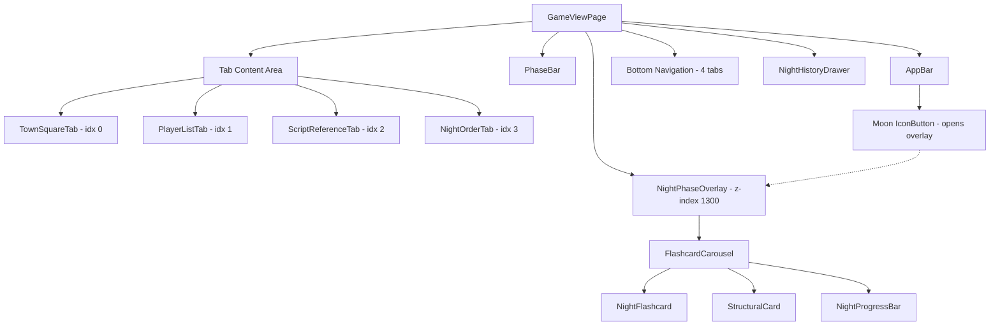
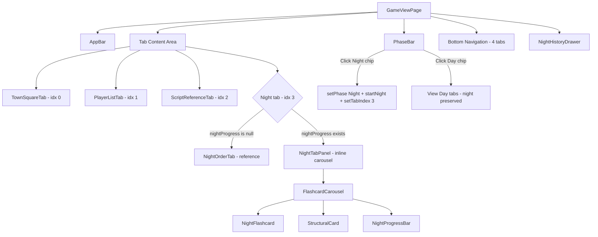
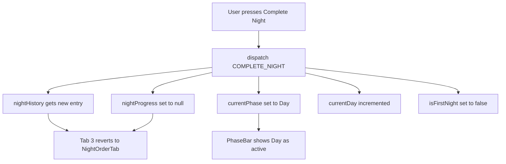

# Day/Night Tab Workflow — Architectural Plan

> **Milestone 15** — Render the Night flashcard carousel inline as tab content instead of a full-screen overlay.

---

## 1. Recommendation Summary

**Option C — Transform the Night Order tab into an "Active Night" tab during night phase.** Keep 4 bottom tabs at all times; the Night Order tab (index 3) becomes the flashcard carousel when a night is in progress.

This is the cleanest approach because:
- No extra tab crowding mobile bottom nav (stays at 4)
- Night Order and Active Night are semantically related (same domain)
- The user's mental model is: "I tap the moon tab to do night stuff"
- PhaseBar becomes the phase indicator + night trigger, not a separate navigation surface
- Aligns perfectly with the user's feedback in [`Milestoneoverload.md`](../docs/milestones/Milestoneoverload.md): *"clicking on the night tab should go directly into the flashcards"*

---

## 2. Detailed Design

### 2.1 Tab Structure — The "Dual-Mode Night Tab"

The 4 bottom tabs remain as-is, but tab index 3 has two modes:

| Game Phase | Tab 3 Label | Tab 3 Icon | Tab 3 Content |
|------------|-------------|------------|---------------|
| Day (no active night) | Night Order | `NightlightRoundIcon` | [`NightOrderTab`](../UI/src/components/NightOrder/NightOrderTab.tsx) — reference list |
| Night (active night in progress) | Night ● | `NightlightRoundIcon` + badge dot | [`FlashcardCarousel`](../UI/src/components/NightPhase/FlashcardCarousel.tsx) — inline |
| Day (night still in progress, not completed) | Night ● | `NightlightRoundIcon` + badge dot | [`FlashcardCarousel`](../UI/src/components/NightPhase/FlashcardCarousel.tsx) — resume |

The badge dot on the Night tab icon indicates "a night is in progress" — visible from any tab.

### 2.2 PhaseBar Interaction

[`PhaseBar.tsx`](../UI/src/components/PhaseBar/PhaseBar.tsx) changes:

| Action | Current Behavior | New Behavior |
|--------|-----------------|--------------|
| Click Night chip | Confirmation dialog → sets phase | **No dialog.** Immediately sets phase to Night, dispatches `START_NIGHT`, and auto-switches `tabIndex` to 3 |
| Click Day chip (during active night) | Blocked (requires Complete Night flow) | **Allowed.** Switches view back to Day tabs. Night progress is preserved. User can return via tab 3 |
| Night chip visual | Active/inactive styling | Same, plus pulsing dot or subtle animation when night is in progress |

**PhaseBar is NOT removed** — it serves as the phase indicator and the "start night" trigger. The Day chip during an active night lets the user peek at Day tabs without losing night progress.

### 2.3 Night Tab Click Behavior

```
User clicks Night tab (index 3)
        │
        ▼
  Is nightProgress non-null?
        │
    ┌───┴───┐
    Yes     No
    │       │
    ▼       ▼
  Show      Is currentPhase Night?
  carousel  │
  at saved  ┌───┴───┐
  index     Yes     No
            │       │
            ▼       ▼
          Start     Show NightOrderTab
          night     (reference view)
          (auto
          START_NIGHT)
            │
            ▼
          Show carousel
          at index 0
```

### 2.4 Moon Icon in AppBar — Removal

The moon icon button in [`GameViewPage.tsx`](../UI/src/pages/GameViewPage.tsx) lines 220-230 becomes redundant:
- Currently: clicking it sets `nightOverlayOpen` to open the full-screen overlay
- New: the Night tab (index 3) is the sole entry point
- **Remove the moon `IconButton`** from the AppBar toolbar

### 2.5 Night History Review — Keep as Overlay

[`NightHistoryReview.tsx`](../UI/src/components/NightHistory/NightHistoryReview.tsx) remains a full-screen overlay (z-index 1400) because:
- It reviews **past** data, not the active gameplay flow
- It's accessed from the [`NightHistoryDrawer`](../UI/src/components/NightHistory/NightHistoryDrawer.tsx) (a side drawer), not from tab navigation
- The overlay z-index no longer conflicts since the active night overlay is being removed
- No UX benefit to making it tab-based — it's a modal review action

The [`NightHistoryDrawer`](../UI/src/components/NightHistory/NightHistoryDrawer.tsx) also stays as-is (side drawer from AppBar history button).

---

## 3. Component Architecture

### 3.1 Current Flow



### 3.2 Proposed Flow



### 3.3 New Component: NightTabPanel

A new thin wrapper component that replaces [`NightPhaseOverlay`](../UI/src/components/NightPhase/NightPhaseOverlay.tsx) as the host for [`FlashcardCarousel`](../UI/src/components/NightPhase/FlashcardCarousel.tsx):

```
NightTabPanel.tsx
├── Owns the same logic currently in NightPhaseOverlay:
│   ├── handleUpdateProgress
│   ├── handleUpdateNotes
│   ├── handleUpdateSelection
│   └── handleComplete
├── Does NOT own:
│   ├── Fixed positioning (no overlay)
│   ├── Dismiss button (no dismiss — its a tab)
│   └── z-index stacking
├── Background styling:
│   └── Dark gradient background applied to the tab content area
└── Renders FlashcardCarousel inline
```

**Key difference from overlay:** NightTabPanel is a normal flex-child that fills the tab content area (`flex: 1, overflow: hidden`), not a `position: fixed` overlay.

---

## 4. State Changes

### 4.1 GameContext — Persist Card Index

The existing [`NightProgress`](../UI/src/types/index.ts:289) type already has `currentCardIndex`. Currently, [`FlashcardCarousel`](../UI/src/components/NightPhase/FlashcardCarousel.tsx:57) initializes local state from it but never writes back:

```typescript
// Current: one-way read
const [currentIndex, setCurrentIndex] = useState(nightProgress.currentCardIndex);
```

**Change needed:** When the user navigates cards, sync `currentCardIndex` back to `nightProgress` in GameContext so it persists across tab switches.

Options:
- **A) Add a `SET_NIGHT_CARD_INDEX` action** — FlashcardCarousel calls it on every card change
- **B) Lift `currentIndex` to NightTabPanel** — pass it down as a controlled prop

**Recommendation: Option A** — simpler, keeps FlashcardCarousel's swipe logic self-contained, and the index is already part of `NightProgress`.

New reducer action:
```typescript
| { type: 'SET_NIGHT_CARD_INDEX'; payload: { index: number } }
```

New helper on [`GameContextValue`](../UI/src/context/GameContext.tsx:309):
```typescript
setNightCardIndex: (index: number) => void;
```

### 4.2 FlashcardCarousel Changes

- Accept an optional `onCardChange?: (index: number) => void` callback prop
- Call it whenever `currentIndex` changes (in `goTo` and `goToIndex`)
- NightTabPanel passes `setNightCardIndex` as the callback
- NightHistoryReview does NOT pass it (history review doesn't need persistence)

### 4.3 PhaseBar Changes

[`PhaseBar`](../UI/src/components/PhaseBar/PhaseBar.tsx) needs a new prop to control the tab:

```typescript
interface PhaseBarProps {
  onNightStart?: () => void;  // Called after setting phase to Night
  onDaySwitch?: () => void;   // Called when switching view back to Day
}
```

Or alternatively, PhaseBar calls a callback that GameViewPage uses to set `tabIndex`.

### 4.4 Day Chip During Active Night

Currently, clicking Day while in Night phase is blocked (line 43 of PhaseBar):
```typescript
if (currentPhase === Phase.Night && targetPhase === Phase.Day) return;
```

**This line stays.** The Day chip does NOT change the phase — it's the PhaseBar that controls phase, not tab visibility. Instead, GameViewPage lets the user switch tabs freely during night. The user can click any of the 4 tabs to see Day content while a night is in progress.

The mental model becomes:
- **Phase** (Day/Night) = game state, controlled by PhaseBar
- **Tab** (0-3) = what you're looking at, controlled by bottom nav
- During Night phase, tabs 0-2 still show their normal Day content, tab 3 shows the flashcard carousel

---

## 5. Visual Indicators

### 5.1 Night-in-Progress Badge

When `nightProgress !== null`, the Night tab (index 3) in BottomNavigation shows a badge dot:

```typescript
<BottomNavigationAction
  label={nightProgress ? 'Night' : 'Night Order'}
  icon={
    <Badge variant="dot" invisible={!nightProgress} color="warning">
      <NightlightRoundIcon />
    </Badge>
  }
/>
```

### 5.2 Tab Content Background

When displaying the flashcard carousel inline, the tab content area gets the dark gradient background that currently lives in [`NightPhaseOverlay`](../UI/src/components/NightPhase/NightPhaseOverlay.tsx:122-123):

```css
background: linear-gradient(180deg, #0d1117 0%, #161b22 50%, #0d1117 100%)
```

This creates a clear visual distinction between Day tabs (light MUI theme) and the Night tab (dark themed).

### 5.3 Bottom Nav During Night

The bottom nav itself stays light-themed. Only the content area above it changes. This keeps navigation always visible and usable.

---

## 6. Gesture Conflict Resolution

**Problem:** The FlashcardCarousel uses horizontal swipe (via `react-swipeable`) for card navigation. MUI BottomNavigation does not natively support swipe-to-switch-tabs, so there is **no actual conflict** with the current setup.

**If swipe-to-switch-tabs is ever added:** The carousel's `preventScrollOnSwipe: true` and `delta: 40` settings would need to be increased, or swipe-to-switch would need to be disabled when on the Night tab.

**Current status: No action needed.**

---

## 7. Complete Night Flow

When the user presses "Complete Night" on the last flashcard:



This already works via the existing [`COMPLETE_NIGHT`](../UI/src/context/GameContext.tsx:207) reducer case. The only change is that after completion, the tab content for index 3 automatically shows NightOrderTab again (because `nightProgress` becomes `null`).

**Optional UX:** After completing a night, auto-switch to tab 0 (Town Square) since the Storyteller will want to announce "day has begun." This can be a callback from `handleComplete`.

---

## 8. Files Changed

### New Files

| File | Purpose |
|------|---------|
| `UI/src/components/NightPhase/NightTabPanel.tsx` | Thin wrapper hosting FlashcardCarousel inline, with night progress handlers |
| `UI/src/components/NightPhase/NightTabPanel.test.tsx` | Tests for the new component |

### Modified Files

| File | Change |
|------|--------|
| [`GameViewPage.tsx`](../UI/src/pages/GameViewPage.tsx) | Replace NightPhaseOverlay with conditional NightTabPanel/NightOrderTab at index 3; remove moon icon; add tab auto-switch on night start/complete |
| [`GameViewPage.test.tsx`](../UI/src/pages/GameViewPage.test.tsx) | Update tests for inline night tab behavior |
| [`PhaseBar.tsx`](../UI/src/components/PhaseBar/PhaseBar.tsx) | Remove confirmation dialog; add `onNightStart` callback; allow Day chip during night as view-switch |
| [`PhaseBar.test.tsx`](../UI/src/components/PhaseBar/PhaseBar.test.tsx) | Remove dialog tests; add direct-transition tests |
| [`FlashcardCarousel.tsx`](../UI/src/components/NightPhase/FlashcardCarousel.tsx) | Add `onCardChange` callback prop; call it on card navigation |
| [`FlashcardCarousel.test.tsx`](../UI/src/components/NightPhase/FlashcardCarousel.test.tsx) | Test onCardChange callback |
| [`GameContext.tsx`](../UI/src/context/GameContext.tsx) | Add `SET_NIGHT_CARD_INDEX` action + `setNightCardIndex` helper |
| [`GameContext.test.tsx`](../UI/src/context/GameContext.test.tsx) | Test new reducer action |

### Deleted/Deprecated Files

| File | Action |
|------|--------|
| [`NightPhaseOverlay.tsx`](../UI/src/components/NightPhase/NightPhaseOverlay.tsx) | **Delete** — replaced by NightTabPanel |
| [`NightPhaseOverlay.test.tsx`](../UI/src/components/NightPhase/NightPhaseOverlay.test.tsx) | **Delete** — tests replaced by NightTabPanel tests |

### Unchanged Files

| File | Reason |
|------|--------|
| [`NightHistoryReview.tsx`](../UI/src/components/NightHistory/NightHistoryReview.tsx) | Stays as full-screen overlay — reviews past data |
| [`NightHistoryDrawer.tsx`](../UI/src/components/NightHistory/NightHistoryDrawer.tsx) | Stays as side drawer |
| [`NightFlashcard.tsx`](../UI/src/components/NightPhase/NightFlashcard.tsx) | No changes needed |
| [`NightProgressBar.tsx`](../UI/src/components/NightPhase/NightProgressBar.tsx) | No changes needed |
| [`StructuralCard.tsx`](../UI/src/components/NightPhase/StructuralCard.tsx) | No changes needed |
| [`NightOrderTab.tsx`](../UI/src/components/NightOrder/NightOrderTab.tsx) | No changes needed |

---

## 9. Trade-offs

| Aspect | Pro | Con |
|--------|-----|-----|
| 4 tabs constant | Familiar, no mobile crowding | Night Order reference is inaccessible during active night |
| Night Order hidden during active night | Focused on the task at hand | User cant cross-reference night order while doing the night |
| No confirmation dialog | Faster workflow, per user feedback | Accidental night starts possible (mitigated: Complete Night is explicit) |
| PhaseBar kept | Clear phase indicator, familiar trigger | One more UI element vs. pure tab-based approach |
| History stays overlay | Clean separation of live vs. past review | Two different UX patterns for the same carousel component |

### Mitigation for "Night Order inaccessible during active night"

The flashcard carousel IS the night order — it shows the same characters in the same order, with interactive features. The static Night Order reference list is redundant while doing the night. If the user needs to see the full list, they can scroll through the flashcard dots in the progress bar.

---

## 10. Implementation Order

1. **GameContext** — Add `SET_NIGHT_CARD_INDEX` action + helper
2. **FlashcardCarousel** — Add `onCardChange` prop
3. **NightTabPanel** — New component (extract logic from NightPhaseOverlay)
4. **PhaseBar** — Remove confirmation dialog; add `onNightStart` callback
5. **GameViewPage** — Wire everything together; remove overlay + moon icon
6. **Delete NightPhaseOverlay** — Remove the old overlay component + tests
7. **Tests** — Update all test files
8. **Storybook** — Update PhaseBar stories; add NightTabPanel stories
